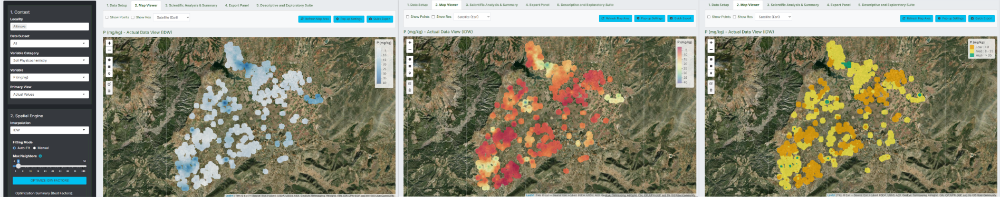
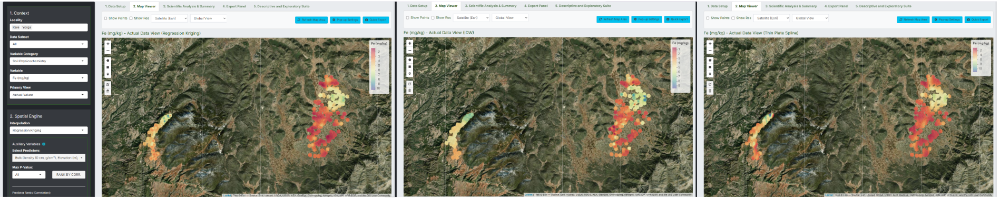
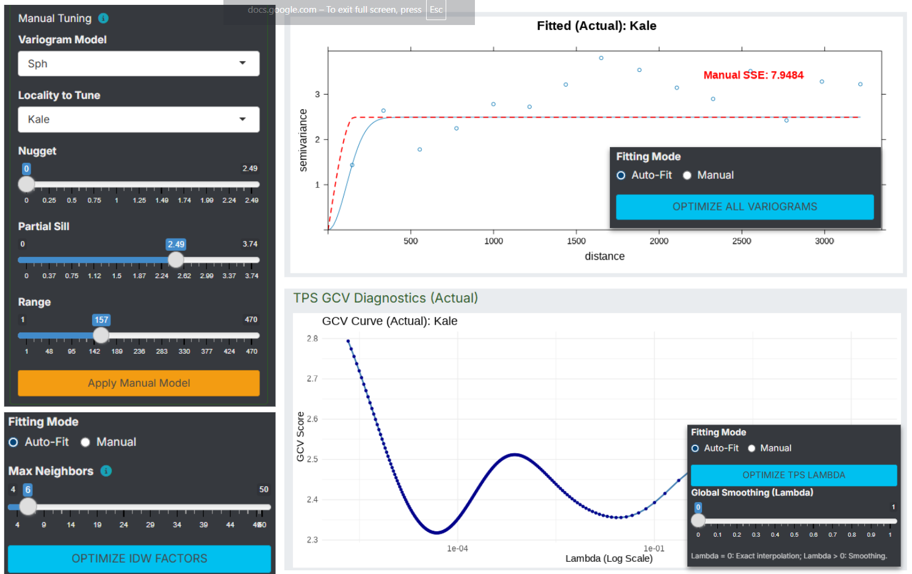
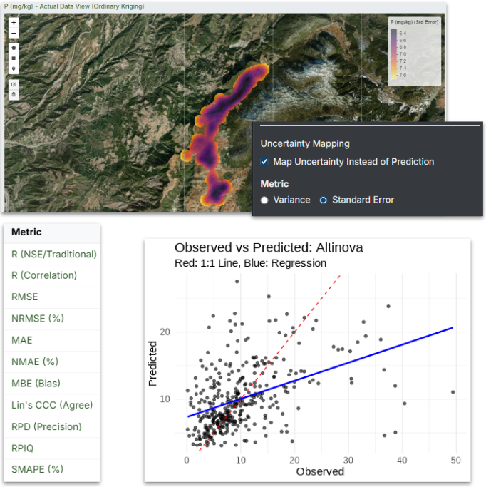
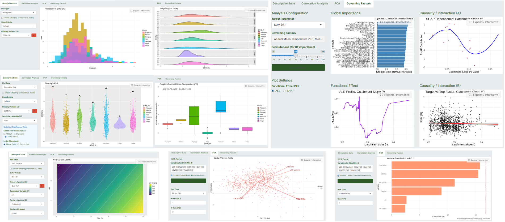
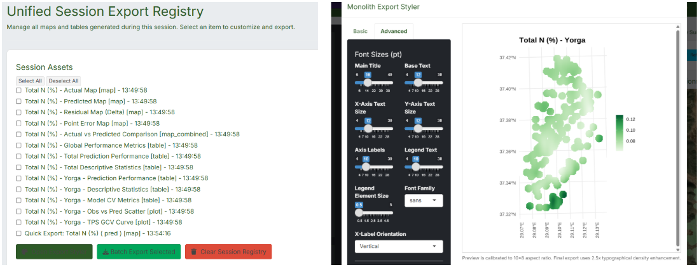
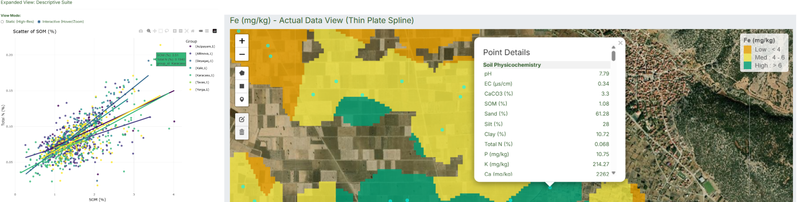
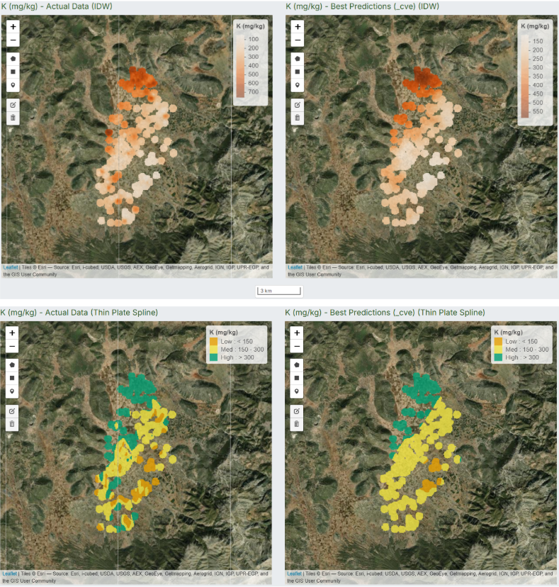
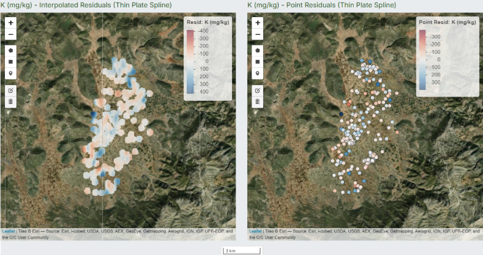

# Monolith 0.9.0: Advanced Spatial Analysis Dashboard
*Monolith* is a high-performance R Shiny application designed for proper (or a standardized, at least) spatial statistical analysis, geostatistical modeling, and mapping. It provides a comprehensive toolkit for exploring spatial variability, you may find it well-suited for research in soil science, life sciences, and agronomy.

Whether you are mapping soil physicochemistry, analyzing topographical interactions, or generating publication-ready **spatial, descriptive and multi-criteria explorative metrics**, Monolith provides a seamless, parallel-processed environment to ingest, interpolate, interpret and export the data for continuous and classified maps.


# Key Features
* **Diverse Spatial Engine**: Deterministic and geostatistical interpolation models for contunious and classified maps of your small fields or vast plains you study on. Monolith’s classification engine automatically translates continuous predictions (e.g., Nitrogen levels) into standard agronomical zones. It outputs exact area coverages (in hectares).


  - Inverse Distance Weighting (IDW), 
  
  - Thin Plate Splines (TPS), 

  - Ordinary Kriging (OK), 

  - Co-Kriging (CK), 

  - Regression Kriging (RK), 
  
  - Random Forest Kriging (RFK).

   
   
  
  
* **Automated & Manual Optimization of Model Fittings**: Automated least-squares fitting for variograms for four different models, Generalized Cross-Validation (GCV) for TPS, and Leave-One-Out Cross-Validation (LOOCV) based power optimization for IDW. Interactive variogram fitting and manual tuning overrides are available for expert calibration. When the interpolation run, each results of interpolation will be instantly available for batch export.

   


* **Comprehensive Diagnostics**: Evaluate models through LOOCV. Generate advanced metrics including Nash-Sutcliffe Efficiency (NSE), RPD, RPIQ, and Moran's I for spatial autocorrelation.

   


* **Descriptive & Exploratory Suite**: Understand your dataset with simultaneous descriptive, correlation, and principal component analyses with results that can be instantly generated and observed by simultaneous categorization and data popularization of choice. An additional variable importance -or maybe a factor- analysis section is included to possibly increase the understanding of observed spatial data.

   

* **Unified Export Registry**: Compile session assets into a centralized registry. Use the integrated WYSIWYG Styler to customize typography, DPI, and layout for publication-ready outputs (.PNG, .TIFF, .PDF) or batch-export everything with statistical tabular data merged into a Excel file.

   


* **Dynamic UI & Theming**: Fully responsive interface with customizable themes and figures, accessible data details on maps/graphs for visual audits of hot-points.

   


## Mapping Predictions and Interpreting Spatial Resonance of Prediction Errors 

**1. Visual Validation**

Monolith generates side-by-side "Actual" and "Predicted" surfaces. By matching the color scales, you can instantly verify if the model captures the true variance of the field or just smooths the data.

   


**2. Residual Diagnostics**

To understand the spatial structure of model errors, Monolith provides two diagnostic maps:

*Surface Delta (Regional Bias):* Subtracts the predicted surface from the actual surface to reveal zones of consistent over- or under-prediction.

*Point Errors (Predictive Model Uncertainty)*: Interpolates prediction errors at exact sampling points to map zones where the model fails to capture local variation.

   


# Installation & Setup Guide

## 1. System Prerequisites

Before installing the application, ensure you have the following software installed:

*   **R:** Version 4.5.0 or higher is highly recommended. You can download it from [CRAN](https://cran.r-project.org/).
*   **RStudio (Optional but recommended):** The easiest way to run and interact with Shiny applications. Download from [Posit](https://posit.co/download/rstudio-desktop/).
*   **System Dependencies for Spatial Packages:** 
    *   **Windows:** Generally, RTools handles most binary dependencies. Download [RTools](https://cran.r-project.org/bin/windows/Rtools/) matching your R version.
    *   **macOS:** You may need to install `gdal` and `proj` via Homebrew (`brew install gdal proj`).
    *   **Linux (Ubuntu/Debian):** Install spatial libraries using your package manager:
        ```bash
        sudo apt-get update
        sudo apt-get install libgdal-dev libproj-dev libgeos-dev libudunits2-dev
        ```

## 2. Package Dependencies

The Monolith dashboard relies on a comprehensive suite of R packages for its spatial engine, statistical analytics, and user interface. 

You can install all required packages by running the following script in your R console:

```R
# Core Shiny & UI Framework
install.packages(c("shiny", "shinyjs", "shinyWidgets", "shinyFiles", "shinycssloaders"))

# Spatial Data & Mapping
install.packages(c("sf", "terra", "leaflet", "leaflet.extras", "concaveman"))

# Geostatistics & Machine Learning
install.packages(c("gstat", "automap", "randomForest", "fields", "DALEX"))

# Data Manipulation & Metrics
install.packages(c("dplyr", "tidyr", "readxl", "openxlsx", "yardstick"))

# Data Visualization
install.packages(c("ggplot2", "ggpubr", "patchwork", "tidyterra", "ggspatial", "plotly", "latticeExtra"))

# Color Palettes & Theming
install.packages(c("RColorBrewer", "viridis", "classInt", "showtext"))

# Export & Asynchronous Processing
install.packages(c("future", "furrr", "promises", "progressr", "officer", "zip", "jsonlite"))
```

## 3. Application Structure

Ensure your project directory maintains the following structure. The application consists of a main runner file and several helper scripts:

```
monolith/
│
├── monolith_ver_0.8.9.R        # Main Application Runner
├── improvements/               # Modular Source Files
│   ├── spatial_helpers_0.8.9.R # Spatial math & CV logic
│   ├── ui_helpers_0.8.9.R      # Analytics & descriptive plots
│   └── theme_helpers_0.8.9.R   # Theming & export configurations
├── assets/                     # (Optional) Static assets, custom CSS

```

## 4. Running the Application

### Option A: Using RStudio (Recommended)
1. Open the `monolith_ver_0.8.9.R` file in RStudio.
2. Ensure all required packages are installed and loaded without errors.
3. Click the **"Run App"** button located at the top right of the source editor.

### Option B: Using the R Console
1. Open your R console or terminal.
2. Set your working directory to the folder containing the app:
   ```R
   setwd("/path/to/your/monolith/directory")
   ```
3. Launch the Shiny app:
   ```R
   shiny::runApp("monolith_ver_0.8.9.R")
   ```


[def]: assets/2.png