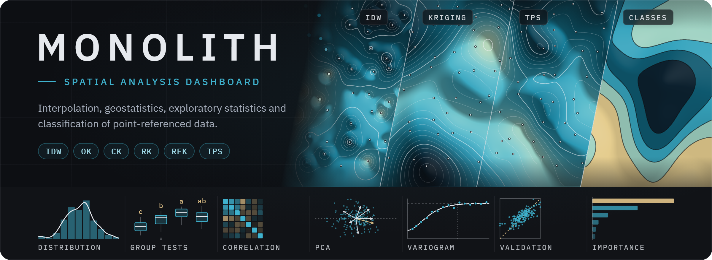
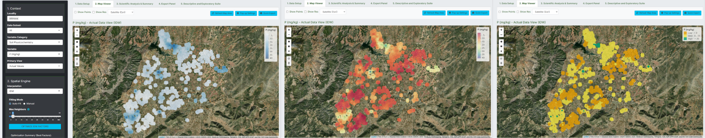
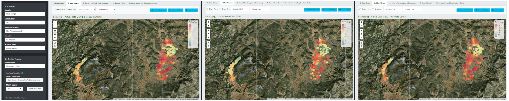
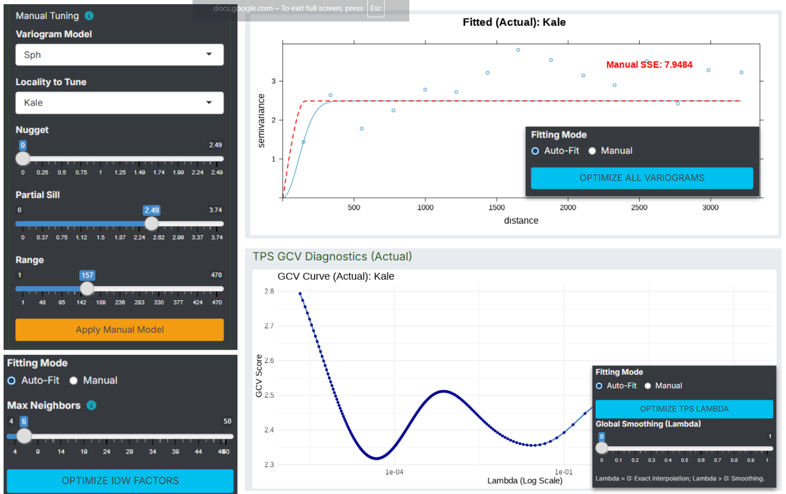
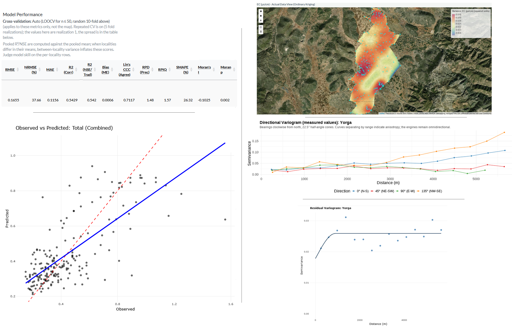
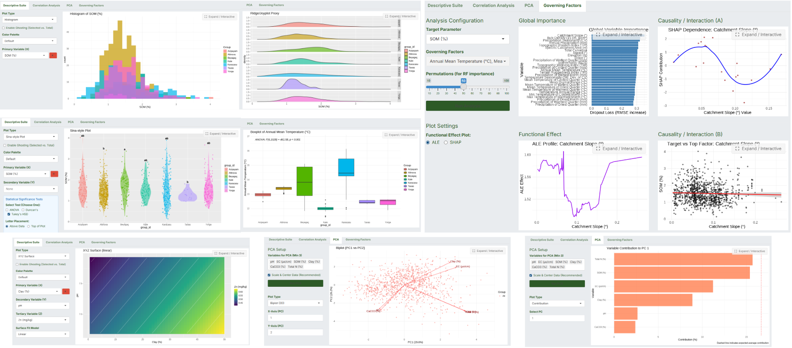
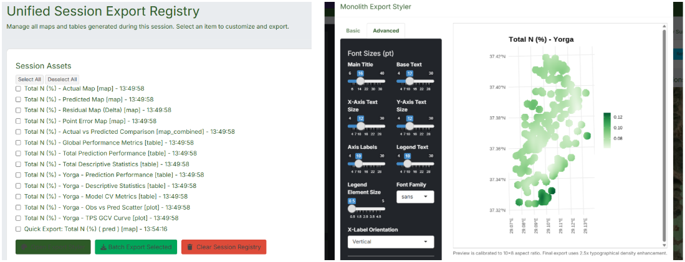
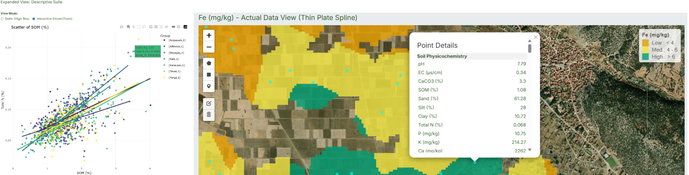
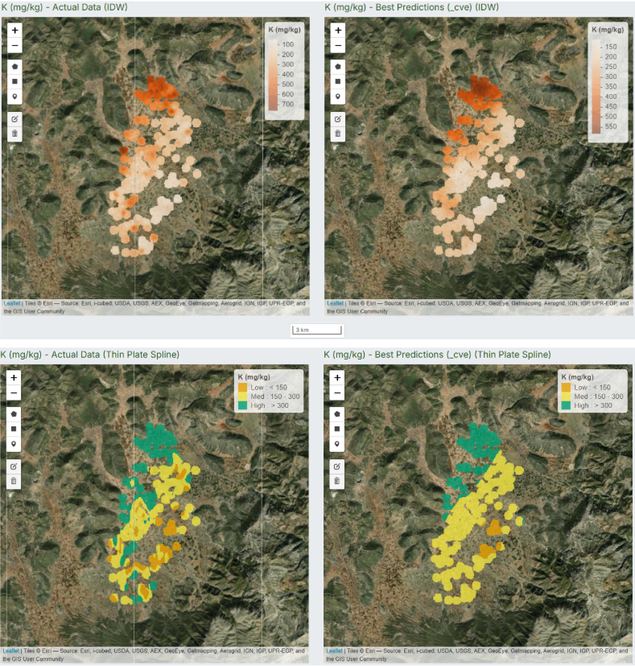
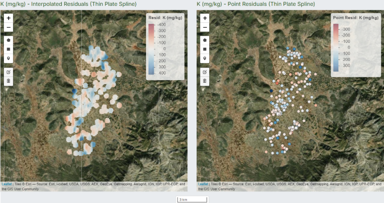

# Monolith 0.9.8d — Spatial Analysis Dashboard

[](#)
[](https://cran.r-project.org/)
[](https://shiny.posit.co/)
[](LICENSE)
[](#1-system-prerequisites)

*Monolith* is an R Shiny application designed for proper (or a standardized, at least) spatial statistical analysis, geostatistical modeling, and mapping. It provides a comprehensive toolkit for exploring spatial variability, and you may find it well-suited for research in soil science, life sciences, and agronomy.

Whether you are mapping soil physicochemistry, analyzing topographical interactions, or generating publication-ready **spatial, descriptive and multi-criteria explorative metrics**, Monolith provides a seamless, parallel-processed environment to ingest, interpolate, interpret and export the data for continuous and classified maps.

## Contents

- [Key Features](#key-features)
- [Mapping Predictions and Interpreting Spatial Resonance of Prediction Errors](#mapping-predictions-and-interpreting-spatial-resonance-of-prediction-errors)
- [Installation & Setup Guide](#installation--setup-guide)
  - [1. System Prerequisites](#1-system-prerequisites)
  - [2. Getting the Code](#2-getting-the-code)
  - [3. Package Dependencies](#3-package-dependencies)
  - [4. Application Structure](#4-application-structure)
  - [5. Running the Application](#5-running-the-application)
- [Documentation](#documentation)
- [Testing & Reproducibility](#testing--reproducibility)
- [Development & AI Assistance](#development--ai-assistance)
- [How to Cite](#how-to-cite)
- [Contributing & Support](#contributing--support)
- [License](#license)
- [Disclaimer](#disclaimer)

# Key Features

* **Diverse Spatial Engine**: Deterministic and geostatistical interpolation models for continuous and classified maps of your small fields or vast plains you study on. Monolith's classification engine automatically translates continuous predictions (e.g., Nitrogen levels) into standard agronomical zones. It outputs exact area coverages (in hectares).

  - Inverse Distance Weighting (IDW),

  - Thin Plate Splines (TPS),

  - Ordinary Kriging (OK),

  - Co-Kriging (CK),

  - Regression Kriging (RK),

  - Random Forest Kriging (RFK).

  
  


* **Automated & Manual Optimization of Model Fittings**: Automated least-squares fitting for variograms for four different models, Generalized Cross-Validation (GCV) for TPS, and Leave-One-Out Cross-Validation (LOOCV) based power optimization for IDW. Interactive variogram fitting and manual tuning overrides are available for expert calibration. Once an interpolation run completes, each result is instantly available for batch export.

  


* **Comprehensive Diagnostics**: Evaluate models through LOOCV. Generate advanced metrics including Nash-Sutcliffe Efficiency (NSE), CCC, RPD, RPIQ, and Moran's I for spatial autocorrelation.

  


* **Descriptive & Exploratory Suite**: Understand your dataset with simultaneous descriptive, correlation, and principal component analyses with results that can be instantly generated and observed by simultaneous categorization and data popularization of choice. An additional Governing Factors module computes variable importance and effects via Random Forest models with ALE and PDP analyses, decoupled as of v0.9.6 for advanced performance and modularity.

  

* **Unified Export Registry**: Compile session assets into a centralized registry. Use the integrated WYSIWYG Styler to customize typography, DPI, and layout for publication-ready outputs (.PNG, .TIFF, .PDF) or batch-export everything with statistical tabular data merged into an Excel file.

  


* **Dynamic UI & Theming**: Fully responsive interface with customizable themes and figures, accessible data details on maps/graphs for visual audits of hot-points.

  


## Mapping Predictions and Interpreting Spatial Resonance of Prediction Errors

**1. Visual Validation**

Monolith generates side-by-side "Actual" and "Predicted" surfaces. By matching the color scales, you can instantly verify if the model captures the true variance of the field or just smooths the data.

  


**2. Residual Diagnostics**

To understand the spatial structure of model errors, Monolith provides two diagnostic maps:

*Surface Delta (Regional Bias):* Subtracts the predicted surface from the actual surface to reveal zones of consistent over- or under-prediction.

*Point Errors (Predictive Model Uncertainty)*: Interpolates prediction errors at exact sampling points to map zones where the model fails to capture local variation.

  


# Installation & Setup Guide

## 1. System Prerequisites

Before installing the application, ensure you have the following software installed:

*   **R:** Version **4.5.0 or higher** is required; Monolith is developed and tested on **R 4.5.2**. You can download it from [CRAN](https://cran.r-project.org/).
*   **RStudio (Optional but recommended):** The easiest way to run and interact with Shiny applications. Download from [Posit](https://posit.co/download/rstudio-desktop/).
*   **System Dependencies for Spatial Packages:** The spatial stack (`sf`, `terra`) links against GDAL, GEOS and PROJ. Monolith is tested against **GDAL 3.11.4, GEOS 3.13.1 and PROJ 9.7.0**; any reasonably recent releases of these libraries will work.
    *   **Windows:** Nothing to do — CRAN ships the spatial packages as self-contained binaries. Installing [RTools](https://cran.r-project.org/bin/windows/Rtools/) (matching your R version) is only needed if a package must be compiled from source.
    *   **macOS:** You may need to install `gdal` and `proj` via Homebrew (`brew install gdal proj`).
    *   **Linux (Ubuntu/Debian):** Install spatial libraries using your package manager:
        ```bash
        sudo apt-get update
        sudo apt-get install libgdal-dev libproj-dev libgeos-dev libudunits2-dev
        ```

## 2. Getting the Code

Two equally valid ways to obtain Monolith:

*   **Download as ZIP (no Git required):** Click the green **`<> Code`** button at the top of this repository page, choose **Download ZIP**, and extract it anywhere on your machine.
*   **Clone with Git:**
    ```bash
    git clone https://github.com/rserdarkara-hash/monolith.git
    ```

## 3. Package Dependencies

The Monolith dashboard relies on a comprehensive suite of **49 R packages** for its spatial engine, statistical analytics, and user interface.

> [!IMPORTANT]
> **Automated Package Setup:**
> You **do not need** to execute any manual `install.packages(...)` console commands.
> Sourcing the dashboard or launching `monolith.R` automatically triggers a smart **Auto-Installation Hook** inside `global.R`. This hook scans your environment, identifies any missing packages from the required suite, and downloads them non-interactively from the cloud CRAN repository.

The full dependency suite, grouped by function:

| Category | Packages |
|---|---|
| **Core App / UI** | `shiny`, `shinyjs`, `shinyWidgets`, `shinyFiles`, `shinycssloaders`, `DT` |
| **Spatial / GIS** | `sf`, `terra`, `tidyterra`, `leaflet`, `leaflet.extras`, `ggspatial`, `fields`, `classInt`, `gstat`, `automap`, `concaveman`, `spdep`, `FNN` |
| **Data Wrangling & I/O** | `dplyr`, `tidyr`, `data.table`, `jsonlite`, `readxl`, `openxlsx`, `officer`, `zip`, `fs` |
| **Visualization & Theming** | `ggplot2`, `ggpubr`, `plotly`, `RColorBrewer`, `viridis`, `latticeExtra`, `patchwork`, `fresh`, `showtext`, `scales`, `commonmark`, `glue` |
| **Statistics & Machine Learning** | `randomForest`, `DALEX`, `yardstick`, `agricolae`, `mgcv`, `nortest` |
| **Parallelization / Async** | `future`, `furrr`, `promises` |

<details>
<summary><strong>Tested version matrix</strong> — the exact package versions Monolith 0.9.8d is developed and validated against (click to expand)</summary>

<br>

Newer CRAN releases are expected to work; if you encounter an inconsistency, matching these versions is the first troubleshooting step.

| Package | Version | Package | Version | Package | Version |
|---|---|---|---|---|---|
| `shiny` | 1.13.0 | `dplyr` | 1.2.0 | `randomForest` | 4.7-1.2 |
| `shinyjs` | 2.1.1 | `tidyr` | 1.3.1 | `DALEX` | 2.5.3 |
| `shinyWidgets` | 0.9.0 | `data.table` | 1.18.2 | `yardstick` | 1.3.2 |
| `shinyFiles` | 0.9.3 | `jsonlite` | 2.0.0 | `agricolae` | 1.3-7 |
| `shinycssloaders` | 1.1.0 | `readxl` | 1.4.5 | `mgcv` | 1.9-4 |
| `DT` | 0.34.0 | `openxlsx` | 4.2.8 | `nortest` | 1.0-4 |
| `sf` | 1.1-0 | `officer` | 0.7.3 | `future` | 1.69.0 |
| `terra` | 1.8-93 | `zip` | 2.3.3 | `furrr` | 0.3.1 |
| `tidyterra` | 1.0.0 | `fs` | 2.1.0 | `promises` | 1.5.0 |
| `leaflet` | 2.2.3 | `ggplot2` | 4.0.2 | `patchwork` | 1.3.2 |
| `leaflet.extras` | 2.0.1 | `ggpubr` | 0.6.3 | `fresh` | 0.2.2 |
| `ggspatial` | 1.1.10 | `plotly` | 4.12.0 | `showtext` | 0.9-7 |
| `fields` | 17.1 | `RColorBrewer` | 1.1-3 | `scales` | 1.4.0 |
| `classInt` | 0.4-11 | `viridis` | 0.6.5 | `commonmark` | 2.0.0 |
| `gstat` | 2.1-5 | `latticeExtra` | 0.6-31 | `glue` | 1.8.0 |
| `automap` | 1.1-20 | `concaveman` | 1.2.0 | `spdep` | 1.4-2 |
| `FNN` | 1.1.4 | | | | |

**Runtime environment:** R 4.5.2 (ucrt) · GDAL 3.11.4 · GEOS 3.13.1 · PROJ 9.7.0 · Windows 11 (also runs on macOS and Linux).

</details>

## 4. Application Structure

Ensure your project directory maintains the following structure. The application consists of a centralized package loader, a main runner file, and several helper scripts:

```
monolith/
│
├── global.R                          # Centralized package loader & environment configuration
├── monolith.R                        # Main Application Runner (Sources global.R)
├── spatial_helpers.R                 # Spatial math, interpolation methods & CV logic
├── ui_helpers.R                      # Analytics, descriptive plots & fuzzy matching helpers
├── theme_helpers.R                   # Theming & export configurations
├── gov_module.R                      # Governing Factors UI & Server Modules
├── desc_exploratory_module.R         # Descriptive & Exploratory Suite (Tab 5 Module)
│
├── assets/                           # Screenshots & static assets
├── docs/                             # User, scientific & module guides
├── sample_data/                      # Demo datasets (restricted license)
├── tests/                            # testthat unit & regression test suite
│
├── README.MD                         # This document
├── LICENSE                           # GPL-3.0 license
└── .gitignore
```

## 5. Running the Application

### Option A: Using RStudio (Recommended)
1. Open the `monolith.R` file in RStudio.
2. Ensure all required packages are installed and loaded without errors.
3. Click the **"Run App"** button located at the top right of the source editor.

### Option B: Using the R Console
1. Open your R console or terminal.
2. Set your working directory to the folder containing the app:
   ```R
   setwd("/path/to/your/monolith/directory")
   ```
3. Launch the Shiny app:
   ```R
   shiny::runApp("monolith.R")
   ```

On first launch, expect a delay while the Auto-Installation Hook downloads any missing packages; subsequent launches are fast.

# Documentation

Detailed guides live in the [docs/](docs/) directory:

| Guide | Contents |
|---|---|
| [User Guide](docs/user_guide.md) | End-to-end walkthrough: data ingestion, interpolation workflow, export registry |
| [Scientific Guide](docs/scientific_guide.md) | Mathematical formulation of the interpolation engines, variogram fitting and cross-validation metrics |
| [Descriptive & Exploratory Guide](docs/desc_exploratory_guide.md) | Descriptive statistics, correlation, PCA and the Governing Factors module |

Sample datasets in [sample_data/](sample_data/) let you exercise every module without your own data (see [License](#license) for their usage restrictions).

# Testing & Reproducibility

Monolith ships with a `testthat` suite covering the interpolation pipeline, cross-validation metrics, metadata matching and the Governing Factors module. To run it from the project root:

```bash
Rscript tests/testthat.R
```

The first run is slow because the harness sources the full application (all 49 packages); this is expected. Scientific accuracy is treated as the project's primary invariant — changes that alter numeric results are gated on these tests.

# Development & AI Assistance

Monolith was built with AI-assisted development tools and is disclosed here in the interest of scientific transparency: the codebase was written with **Gemini CLI / Antigravity**, then systematically audited and refined with **Claude Code (Fable 5)** — covering debugging, performance optimization, and line-by-line verification of the mathematical implementations (interpolation engines, variogram fitting, cross-validation metrics).

Human oversight remained central throughout: all methodological choices, model formulations, and scientific decisions were specified, reviewed, and validated by the author. Numeric behavior is guarded by the `testthat` suite described [above](#testing--reproducibility), and any change that alters numeric results is treated as a scientific decision requiring explicit justification. Responsibility for the correctness of the software rests with the author, not the tools.

# How to Cite

A manuscript describing Monolith's methodology and validation is currently under review at *Geoderma*. Until it is published, please cite the software directly:

```bibtex
@software{monolith2026,
  title   = {Monolith: A Spatial Analysis Dashboard for Geostatistical Modeling and Mapping},
  author  = {Kara, R. Serdar},
  year    = {2026},
  version = {0.9.8d},
  url     = {https://github.com/rserdarkara-hash/monolith},
  note    = {R Shiny application, GPL-3.0}
}
```

This section will be updated with the full journal reference upon publication.

# Contributing & Support

*   **Bug reports & feature requests:** Please open an [Issue](../../issues) on this repository. Include your R version, operating system, and a minimal description of the steps that reproduce the problem.
*   **Questions:** The [Discussions](../../discussions) tab (if enabled) or an Issue are both fine.
*   **Pull requests:** Contributions are welcome under the GPL-3.0 terms. Please make sure the test suite passes (`Rscript tests/testthat.R`) before submitting, and note that any change altering numeric results of the spatial models or metrics requires scientific justification in the PR description.

# License

This project features a dual-licensing structure to protect both open-source contributions and private research datasets:

*   **Software & Source Code**: The core codebase of **Monolith** is licensed under the **GNU General Public License v3.0 (GPL-3.0)**. You are free to run, study, share, and modify the software, provided all derivative works remain open-source under the same terms. See the [LICENSE](LICENSE) file for the full legal text.
*   **Sample Datasets**: The files within the [sample_data/](sample_data/) directory are **not** open-source. They are provided solely for demonstrating and testing the application. You are strictly prohibited from publishing, redistributing, or using these datasets in any scientific publications or external projects. See the `sample_data/DATA_LICENSE` file for the full terms and restrictions.

# Disclaimer

Monolith is provided **"as is"**, without warranty of any kind — express or implied — including, but not limited to, warranties of merchantability, fitness for a particular purpose, and non-infringement, as set out in Sections 15 and 16 of the [GPL-3.0 license](LICENSE). In no event shall the author be liable for any claim, damages, or other liability arising from the use of this software.

In particular, for scientific and applied use: the quality of any interpolation, classification, or statistical output depends on the input data, sampling design, and model assumptions you choose. **You are responsible for validating the results for your own application** — including any agronomic, environmental, or management decision informed by them. The diagnostic tools built into Monolith (cross-validation metrics, residual maps, variogram inspection) exist precisely to support that validation; please use them.
