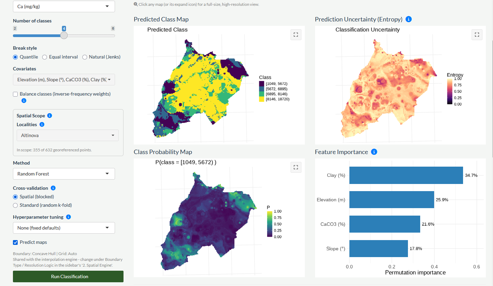

# Monolith Spatial Analysis Dashboard — v1.0.2

[](#)
[](https://cran.r-project.org/)
[](https://shiny.posit.co/)
[](LICENSE)
[](#1-system-prerequisites)
[](https://doi.org/10.5281/zenodo.21130951)


*Monolith* is an R Shiny application designed for proper spatial statistical analysis, geostatistical modeling, and mapping. It provides a comprehensive toolkit for exploring spatial variability, and you may find it well-suited for research in soil science, life sciences, and agronomy.

Whether you are mapping soil physicochemistry, analyzing topographical interactions, or generating publication-ready **spatial, descriptive and multi-criteria explorative metrics**, Monolith provides a seamless, parallel-processed environment to ingest, interpolate, interpret and export the data for continuous and classified maps.

## Contents

- [Features](#features)
  - [Diverse Spatial Engine](#diverse-spatial-engine)
  - [Automated & Manual Optimization of Model Fittings](#automated--manual-optimization-of-model-fittings)
  - [Comprehensive Diagnostics](#comprehensive-diagnostics)
  - [Unified Interpolation Export Registry](#unified-interpolation-export-registry)
  - [Descriptive & Exploratory Suite](#descriptive--exploratory-suite)
  - [Classification Suite](#classification-suite)
  - [Dynamic UI & Theming](#dynamic-ui--theming)
  - [Mapping Machine Learning Predictions of Variables and Interpreting Spatial Resonance of Prediction Errors](#mapping-machine-learning-predictions-of-variables-and-interpreting-spatial-resonance-of-prediction-errors)
  - [Guardrails](#guardrails)
- [Installation & Setup Guide](#installation--setup-guide)
  - [1. System Prerequisites](#1-system-prerequisites)
  - [2. Getting the Code](#2-getting-the-code)
  - [3. Package Dependencies](#3-package-dependencies)
  - [4. Application Structure](#4-application-structure)
  - [5. Running the Application](#5-running-the-application)
- [Documentation](#documentation)
- [Testing & Reproducibility](#testing--reproducibility)
- [Development & AI Assistance](#development--ai-assistance)
- [How to Cite](#how-to-cite)
- [Contributing & Support](#contributing--support)
- [License](#license)
- [Disclaimer](#disclaimer)

# Features

## Diverse Spatial Engine

Deterministic and geostatistical interpolation models for continuous and classified maps, at any scale from single fields to regional landscapes. Monolith's classification engine automatically translates continuous predictions (e.g., Nitrogen levels) into standard agronomical zones. It outputs exact area coverages (in hectares).

- Inverse Distance Weighting (IDW),
- Thin Plate Splines (TPS),
- Ordinary Kriging (OK),
- Co-Kriging (CK),
- Regression Kriging (RK),
- Random Forest Kriging (RFK).


## Automated & Manual Optimization of Model Fittings

Automated least-squares fitting for variograms for four different models, Generalized Cross-Validation (GCV) for TPS, and Leave-One-Out Cross-Validation (LOOCV) based power optimization for IDW. Interactive variogram fitting and manual tuning overrides are available for expert calibration. Once an interpolation run completes, each result is instantly available for batch export.


## Comprehensive Diagnostics

Evaluate models with a selectable cross-validation strategy: Auto (LOOCV for n ≤ 50, seeded random 10-fold above), full Leave-One-Out, or Spatial Block CV (k-means folds, recommended under spatial autocorrelation). Generate advanced metrics including Nash-Sutcliffe Efficiency (NSE), CCC, RPD, RPIQ, and Moran's I for spatial autocorrelation.


## Unified Interpolation Export Registry

Compile session assets into a centralized registry. Use the integrated WYSIWYG Styler to customize typography, DPI, and layout for publication-ready outputs (.PNG, .TIFF, .PDF) or batch-export everything with statistical tabular data merged into an Excel file.


## Descriptive & Exploratory Suite

Understand your dataset with simultaneous descriptive, correlation, and principal component analyses with results that can be instantly generated and observed by simultaneous categorization and data popularization of choice. An additional Governing Factors module computes variable importance and effects via Random Forest models with ALE and PDP analyses, implemented as a decoupled module for performance and modularity.


## Classification Suite

Predictive multiclass classification of categorical field states (e.g., soil/management zones) from co-sampled covariates, distinct from the spatial engine's continuous-to-zone binning. Multinomial, Random Forest, and XGBoost learners share a common preprocessing recipe and spatially-aware cross-validation, with per-class accuracy, entropy-based uncertainty mapping, and learner-aware collinearity diagnostics.



## Dynamic UI & Theming

Fully responsive interface with customizable themes and figures, accessible data details on maps/graphs for visual audits of hot-points.


## Mapping Machine Learning Predictions of Variables and Interpreting Spatial Resonance of Prediction Errors

> **Note:** How well machine-learning predictions agree with the true (measured) values is only half of the story: the deviations that emerge once those predictions are mapped are just as important. A model with acceptable global accuracy can still produce spatially clustered errors, and these only become visible when the predictions and their residuals are examined as surfaces.

**1. Visual Validation**

Monolith generates side-by-side "Actual" and "Predicted" surfaces. By matching the color scales, you can instantly verify if the model captures the true variance of the field or just smooths the data.

  


**2. Residual Diagnostics**

To understand the spatial structure of model errors, Monolith provides two diagnostic maps:

*Surface Delta (Regional Bias):* Subtracts the predicted surface from the actual surface to reveal zones of consistent over- or under-prediction.

*Point Errors (Predictive Model Uncertainty)*: Interpolates prediction errors at exact sampling points to map zones where the model fails to capture local variation.

  


## Guardrails

> **Note:** Scientific correctness is treated as Monolith's primary invariant. Rather than leaving every methodological pitfall to the user, the app builds in guardrails that block, correct, or warn against the most common ways a spatial analysis goes silently wrong. The most important ones:

* **Projected-CRS enforcement:** All interpolation runs in a projected (metric) CRS, and every grid-resolution recommendation is expressed in metres even when the analysis CRS is geographic (degree-based). For degree CRSs, nearest-neighbor distances and extents are measured via a Web Mercator projection corrected by cos(latitude), so degrees are never silently treated as metres. CRS strings are validated before any projection is attempted.

* **Resolution tied to sample support:** The suggested grid spacing is derived from your physical sampling spacing, so the mapped surface cannot fabricate fine, unmeasured detail below the resolution your sampling actually supports.

* **Extrapolation control:** A dynamic buffering engine scales boundary padding to the selected method and resolution, and a **Strict Measured** boundary type disables buffering entirely so coverage is not over-claimed far beyond sample support. In the Classification Suite, predictions are confined to per-locality boundaries and never extend into unsampled corridors between localities.

* **Kriging numerical stability (epsilon-nugget):** For near-zero-variance variables, a tiny nugget is enforced when the empirical nugget is exactly zero, preventing the singular-matrix inversion failures that would otherwise crash Kriging.

* **Variogram fitting:** Automated least-squares fitting sequentially attempts multiple theoretical models (Stein's Matern, Spherical, Exponential, Gaussian, Matern) and falls back to constrained range estimates when standard fitting fails, so a difficult dataset yields a stable curve instead of a crash or a nonsensical fit.

* **Multicollinearity gate (shared across modules):** A single VIF plus pairwise-correlation engine guards every covariate-driven method. Regression Kriging and Random Forest Kriging auto-drop covariates with VIF > 10 before fitting; the pre-run auxiliary-variable screen (covariate-assisted runs) and the Classification Suite flag collinear covariates (method-aware: VIF > 5 for Random Forest, VIF > 10 otherwise) and prompt you to drop or keep them; and the PCA module halts outright when any pair exceeds r > 0.95, requiring an explicit override, to protect the loading vectors from distortion.

* **Spatial cross-validation:** Spatial Block CV (k-means folds) is offered and recommended under spatial autocorrelation so error estimates are not optimistically biased by autocorrelated train/test leakage; it falls back to LOOCV below the minimum fold size. Classification uses spatially-aware resampling, and synthetic oversampling (SMOTE) is deliberately not offered because fabricated points would break the spatial-CV leakage guarantee and invent autocorrelation structure.

* **Classification scope adequacy:** Before a classification run, the scoped data are checked for sufficient sample size and per-class counts. Under-powered scopes (too few rows, or classes below the per-class minimum) raise a named warning identifying the offending classes and their counts, so unreliable rare-class results are surfaced rather than presented as trustworthy.


# Installation & Setup Guide

## 1. System Prerequisites

Before installing the application, ensure you have the following software installed:

*   **R:** Version **4.5.0 or higher** is required; Monolith is developed and tested on **R 4.5.2**. You can download it from [CRAN](https://cran.r-project.org/).
*   **RStudio (Optional but recommended):** The easiest way to run and interact with Shiny applications. Download from [Posit](https://posit.co/download/rstudio-desktop/).
*   **System Dependencies for Spatial Packages:** The spatial stack (`sf`, `terra`) links against GDAL, GEOS and PROJ. Monolith is tested against **GDAL 3.11.4, GEOS 3.13.1 and PROJ 9.7.0**; any reasonably recent releases of these libraries will work.
    *   **Windows:** Nothing to do; CRAN ships the spatial packages as self-contained binaries. Installing [RTools](https://cran.r-project.org/bin/windows/Rtools/) (matching your R version) is only needed if a package must be compiled from source.
    *   **macOS:** You may need to install `gdal` and `proj` via Homebrew (`brew install gdal proj`).
    *   **Linux (Ubuntu/Debian):** Install spatial libraries using your package manager:
        ```bash
        sudo apt-get update
        sudo apt-get install libgdal-dev libproj-dev libgeos-dev libudunits2-dev
        ```

## 2. Getting the Code

Two equally valid ways to obtain Monolith:

*   **Download as ZIP (no Git required):** Click the green **`<> Code`** button at the top of this repository page, choose **Download ZIP**, and extract it anywhere on your machine.
*   **Clone with Git:**
    ```bash
    git clone https://github.com/rserdarkara-hash/monolith.git
    ```

## 3. Package Dependencies

The Monolith dashboard relies on a comprehensive suite of **60 R packages** for its spatial engine, statistical analytics, and user interface.

> [!IMPORTANT]
> **Automated Package Setup:**
> You **do not need** to execute any manual `install.packages(...)` console commands.
> Sourcing the dashboard or launching `monolith.R` automatically triggers a smart **Auto-Installation Hook** inside `global.R`. This hook scans your environment, identifies any missing packages from the required suite, and downloads them non-interactively from the cloud CRAN repository.

The full dependency suite, grouped by function:

| Category | Packages |
|---|---|
| **Core App / UI** | `shiny`, `shinyjs`, `shinyWidgets`, `shinyFiles`, `shinycssloaders`, `DT` |
| **Spatial / GIS** | `sf`, `terra`, `tidyterra`, `leaflet`, `leaflet.extras`, `ggspatial`, `fields`, `classInt`, `gstat`, `automap`, `concaveman`, `spdep`, `FNN` |
| **Data Wrangling & I/O** | `dplyr`, `tidyr`, `data.table`, `jsonlite`, `readxl`, `openxlsx`, `officer`, `zip`, `fs` |
| **Visualization & Theming** | `ggplot2`, `ggpubr`, `plotly`, `RColorBrewer`, `viridis`, `latticeExtra`, `patchwork`, `fresh`, `showtext`, `scales`, `commonmark`, `glue` |
| **Statistics & Machine Learning** | `randomForest`, `DALEX`, `yardstick`, `agricolae`, `mgcv`, `nortest` |
| **Classification (tidymodels)** | `parsnip`, `recipes`, `workflows`, `tune`, `rsample`, `dials`, `spatialsample`, `hardhat`, `ranger`, `xgboost`, `nnet` |
| **Parallelization / Async** | `future`, `furrr`, `promises` |

<details>
<summary><strong>Tested version matrix</strong>: the exact package versions Monolith 1.0.2 is developed and validated against (click to expand)</summary>

<br>

Newer CRAN releases are expected to work; if you encounter an inconsistency, matching these versions is the first troubleshooting step.

| Package | Version | Package | Version | Package | Version |
|---|---|---|---|---|---|
| `shiny` | 1.13.0 | `dplyr` | 1.2.0 | `randomForest` | 4.7-1.2 |
| `shinyjs` | 2.1.1 | `tidyr` | 1.3.1 | `DALEX` | 2.5.3 |
| `shinyWidgets` | 0.9.0 | `data.table` | 1.18.2 | `yardstick` | 1.3.2 |
| `shinyFiles` | 0.9.3 | `jsonlite` | 2.0.0 | `agricolae` | 1.3-7 |
| `shinycssloaders` | 1.1.0 | `readxl` | 1.4.5 | `mgcv` | 1.9-4 |
| `DT` | 0.34.0 | `openxlsx` | 4.2.8 | `nortest` | 1.0-4 |
| `sf` | 1.1-0 | `officer` | 0.7.3 | `future` | 1.69.0 |
| `terra` | 1.8-93 | `zip` | 2.3.3 | `furrr` | 0.3.1 |
| `tidyterra` | 1.0.0 | `fs` | 2.1.0 | `promises` | 1.5.0 |
| `leaflet` | 2.2.3 | `ggplot2` | 4.0.2 | `patchwork` | 1.3.2 |
| `leaflet.extras` | 2.0.1 | `ggpubr` | 0.6.3 | `fresh` | 0.2.2 |
| `ggspatial` | 1.1.10 | `plotly` | 4.12.0 | `showtext` | 0.9-7 |
| `fields` | 17.1 | `RColorBrewer` | 1.1-3 | `scales` | 1.4.0 |
| `classInt` | 0.4-11 | `viridis` | 0.6.5 | `commonmark` | 2.0.0 |
| `gstat` | 2.1-5 | `latticeExtra` | 0.6-31 | `glue` | 1.8.0 |
| `automap` | 1.1-20 | `concaveman` | 1.2.0 | `spdep` | 1.4-2 |
| `FNN` | 1.1.4 | `parsnip` | 1.4.1 | `recipes` | 1.3.1 |
| `workflows` | 1.3.0 | `tune` | 2.0.1 | `rsample` | 1.3.2 |
| `dials` | 1.4.2 | `spatialsample` | 0.6.1 | `hardhat` | 1.4.2 |
| `ranger` | 0.18.0 | `xgboost` | 3.2.0.1 | `nnet` | 7.3.20 |

**Runtime environment:** R 4.5.2 (ucrt) · GDAL 3.11.4 · GEOS 3.13.1 · PROJ 9.7.0 · Windows 11 (also runs on macOS and Linux).

</details>

### Reproducible installation with `renv` (optional)

For an exact, one-command reproduction of the validated environment, the repository ships a [`renv`](https://rstudio.github.io/renv/) lockfile (`renv.lock`) pinning the dependency tree (including transitive dependencies) to the versions in the matrix above. The Classification Suite's tidymodels stack (`parsnip`, `recipes`, `workflows`, `tune`, `rsample`, `dials`, `spatialsample`, `ranger`, `xgboost`, and their dependencies) was added after the current lockfile snapshot; run `renv::snapshot()` once to pin those as well. From the project root:

```r
install.packages("renv")   # once
renv::restore()             # reads renv.lock; confirm the prompt to activate the project
```

This installs the pinned versions into a project-local library without touching your global R library. It is entirely optional; the Auto-Installation Hook described above remains the default path and installs current CRAN releases instead.

## 4. Application Structure

Ensure your project directory maintains the following structure. The application consists of a centralized package loader, a main runner file, and several helper scripts:

```
monolith/
│
├── global.R                          # Centralized package loader & environment configuration
├── monolith.R                        # Main Application Runner (assembles UI + server from the files below)
├── global_utils.R                    # Static configuration & pure utility functions
│
├── ui_main.R                         # Master UI assembly (fluidPage skeleton)
├── ui_sidebar.R                      # Sidebar panel definition
├── ui_main_tabs.R                    # Main tab panel definition
│
├── server_setup.R                    # Session infrastructure, caches & central reactive state
├── server_export.R                   # Export registry, styler & batch export handlers
├── server_map_interactions.R         # Draw tools, popups & point styling
├── server_data_setup.R               # Upload, CRS parsing & variable mapping
├── server_run_config.R               # Display context, config persistence & selectors
├── server_model_tuning.R             # TPS/IDW optimization & variogram tuning
├── server_execution.R                # Parallel interpolation pipeline (future/furrr)
├── server_map_viewer.R               # Leaflet map rendering & proxy overlays
├── server_sci_analysis.R             # Diagnostics, metrics & results tables
│
├── spatial_helpers.R                 # Geostatistical core loader (sources the four spatial_* files)
├── spatial_vgm.R                     # Variogram fitting machinery
├── spatial_metrics.R                 # CV folds, error metrics & Moran's I
├── spatial_kriging.R                 # Interpolation engines (IDW/TPS/OK/CK/RK/RFK)
├── spatial_pipeline.R                # Regional orchestration & parallel worker entry points
│
├── ui_helpers.R                      # UI/analytics helper loader (sources the four ui_* helper files)
├── ui_colors.R                       # Palettes & colour resolution
├── ui_formatting.R                   # Labels, metadata matching & fuzzy matching helpers
├── ui_components.R                   # Shiny widget/tag generators
├── ui_plotting.R                     # Descriptive, correlation, PCA & diagnostic plot builders
│
├── theme_helpers.R                   # Theming & export configurations
├── gov_module.R                      # Governing Factors UI & Server Modules
├── desc_exploratory_module.R         # Descriptive & Exploratory Suite (Tab 5 Module)
├── classif_helpers.R                 # Supervised classification engine (tidymodels)
├── classif_module.R                  # Classification Suite UI & Server Module (Tab 6)
│
├── assets/                           # Screenshots & static assets
├── docs/                             # User, scientific & module guides
├── sample_data/                      # Demo datasets (restricted license)
├── tests/                            # testthat unit & regression test suite
│
├── README.md                         # This document
├── CHANGELOG.md                      # Version history of notable changes
├── LICENSE                           # GPL-3.0 license
└── .gitignore
```

## 5. Running the Application

### Option A: Using RStudio (Recommended)
1. Open the `monolith.R` file in RStudio.
2. Ensure all required packages are installed and loaded without errors.
3. Click the **"Run App"** button located at the top right of the source editor.

### Option B: Using the R Console
1. Open your R console or terminal.
2. Set your working directory to the folder containing the app:
   ```R
   setwd("/path/to/your/monolith/directory")
   ```
3. Launch the Shiny app:
   ```R
   shiny::runApp("monolith.R")
   ```

On first launch, expect a delay while the Auto-Installation Hook downloads any missing packages; subsequent launches are fast.

# Documentation

Detailed guides live in the [docs/](docs/) directory:

| Guide | Contents |
|---|---|
| [User Guide](docs/user_guide.md) | End-to-end walkthrough: data ingestion, interpolation workflow, export registry |
| [Scientific Guide](docs/scientific_guide.md) | Mathematical formulation of the interpolation engines, variogram fitting, cross-validation metrics and the supervised classification methodology |
| [Descriptive & Exploratory Guide](docs/desc_exploratory_guide.md) | Descriptive statistics, correlation, PCA and the Governing Factors module |

Sample datasets in [sample_data/](sample_data/) let you exercise every module without your own data (see [License](#license) for their usage restrictions).

# Testing & Reproducibility

Monolith ships with a `testthat` suite covering the interpolation pipeline, cross-validation metrics, metadata matching and the Governing Factors module. To run it from the project root:

```bash
Rscript tests/testthat.R
```

The first run is slow because the harness sources the full application (all 60 packages); this is expected. Scientific accuracy is treated as the project's primary invariant; changes that alter numeric results are gated on these tests.

# Development & AI Assistance

Monolith was built with AI-assisted development tools and is disclosed here in the interest of scientific transparency: the codebase was structured into a Shiny App with **Antigravity CLI** (Google DeepMind), then systematically audited and refined with **Claude Code (Fable 5; Anthropic)**, covering debugging, performance optimization, and line-by-line verification of the mathematical implementations (interpolation engines, variogram fitting, cross-validation metrics).

Human oversight remained central throughout: all methodological choices, model formulations, and scientific decisions were specified, reviewed, and validated by the author. Numeric behavior is guarded by the `testthat` suite described [above](#testing--reproducibility), and any change that alters numeric results is treated as a scientific decision requiring explicit justification. Responsibility for the correctness of the software rests with the author, not the tools. This disclosure mirrors the statement in the associated publication (Kara et al., 2026).

# How to Cite

```bibtex
@software{monolith2026,
  title     = {Monolith: A Spatial Analysis Dashboard for Geostatistical Modeling and Mapping},
  author    = {Kara, R. Serdar},
  year      = {2026},
  version   = {1.0.2},
  doi       = {10.5281/zenodo.21130951},
  publisher = {Zenodo},
  url       = {https://github.com/rserdarkara-hash/monolith},
  note      = {R Shiny application, GPL-3.0}
}
```

**Using the sample data?** `samp_data_1.xlsx` (paired with the variable list `samp_var_list.xlsx`) is a dataset with an associated manuscript submitted for peer review. It is provided strictly for demonstration, evaluation, and testing of the Monolith application, and is **not** licensed for third-party use until the associated manuscript is formally published. Upon publication, these datasets will be released under the [Creative Commons Attribution 4.0 International (CC BY 4.0)](https://creativecommons.org/licenses/by/4.0/) license. Until then, all rights are reserved and the restrictions apply to all third parties. See the full terms in [sample_data/DATA_LICENSE](sample_data/DATA_LICENSE).

# Contributing & Support

*   **Bug reports & feature requests:** Please open an [Issue](../../issues) on this repository. Include your R version, operating system, and a minimal description of the steps that reproduce the problem.
*   **Questions:** The [Discussions](../../discussions) tab (if enabled) or an Issue are both fine.
*   **Pull requests:** Contributions are welcome under the GPL-3.0 terms. Please make sure the test suite passes (`Rscript tests/testthat.R`) before submitting, and note that any change altering numeric results of the spatial models or metrics requires scientific justification in the PR description.

# License

This project uses a dual-licensing structure — one license for the software, a separate one for the bundled sample data:

*   **Software & Source Code**: The core codebase of **Monolith** is licensed under the **GNU General Public License v3.0 (GPL-3.0)**. You are free to run, study, share, and modify the software, provided all derivative works remain open-source under the same terms. See the [LICENSE](LICENSE) file for the full legal text.

# Disclaimer

Monolith is provided **"as is"**, without warranty of any kind, express or implied, including, but not limited to, warranties of merchantability, fitness for a particular purpose, and non-infringement, as set out in Sections 15 and 16 of the [GPL-3.0 license](LICENSE). In no event shall the author be liable for any claim, damages, or other liability arising from the use of this software.

In particular, for scientific and applied use: the quality of any interpolation, classification, or statistical output depends on the input data, sampling design, and model assumptions you choose. **You are responsible for validating the results for your own application**, including any agronomic, environmental, or management decision informed by them. The diagnostic tools built into Monolith (cross-validation metrics, residual maps, variogram inspection) exist precisely to support that validation; please use them.
