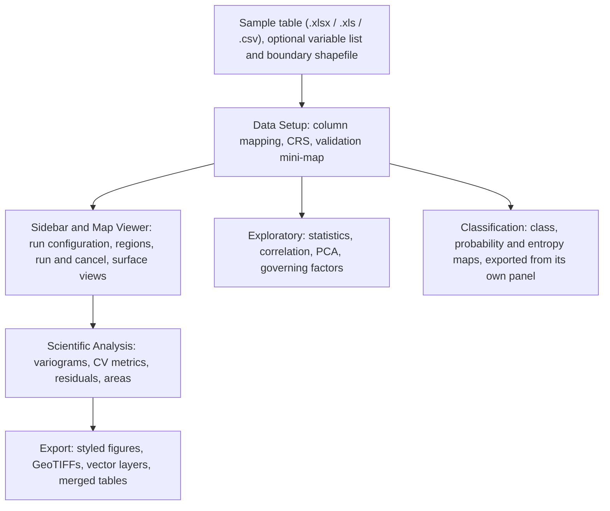

# Monolith Spatial Analysis Dashboard (v1.1.4)

[](#)
[](https://cran.r-project.org/)
[](https://shiny.posit.co/)
[](https://github.com/rserdarkara-hash/monolith/actions/workflows/tests.yaml)
[](https://github.com/rserdarkara-hash/monolith/actions/workflows/upstream.yaml)
[](LICENSE)
[](#1-system-prerequisites)
[](https://doi.org/10.5281/zenodo.21130951)


*Monolith* is an R Shiny application for spatial statistical analysis, geostatistical modelling, and mapping of point-referenced data. It covers the path from a sample table to a finished surface: variogram fitting, interpolation, cross-validated diagnostics, uncertainty mapping, classification, and publication-ready export. It is aimed at soil science, agronomy, and related environmental disciplines.

Whether the target is a soil property, a terrain attribute, or a management-zone map, the workflow is the same: ingest points, interpolate, validate, and export continuous or classified surfaces. Model fitting runs in parallel background workers, so the interface stays responsive during a run, and long jobs can be monitored and cancelled.

## Quick Start

1. Install **R 4.5.0 or higher** (see [System Prerequisites](#1-system-prerequisites)).
2. Download or clone this repository.
3. From the project root, run `shiny::runApp("monolith.R", launch.browser = TRUE)`, or open `monolith.R` in RStudio and click **Run App** with its dropdown set to *Run External*. Use a real browser rather than the RStudio viewer pane, which renders Leaflet maps, large tables and raster overlays noticeably more slowly.
4. On the **Data Setup** tab, upload `sample_data/samp_data_1.xlsx` as the dataset and `sample_data/samp_var_list.xlsx` as the variable list, which gives the sample columns their labels, units and categories. The sample file opens ready to run: **Locality** is preset to Kale and Yorga, the two localities the accompanying manuscript examines in detail (clear the box to map all seven), and both CRS selectors to `EPSG:32635` (UTM 35N), the zone those localities lie in. These presets are keyed on the sample file's name and never apply to a dataset of your own. Check the X/Y columns and the mini-map, choose a method under **Spatial Engine** in the sidebar, and press **Run Interpolation**.

The sample data carries usage restrictions until its associated manuscript is published; see [License](#license).

## Contents

- [Workflow Overview](#workflow-overview)
- [Scientific Guardrails](#scientific-guardrails)
- [Features](#features)
  - [Interpolation Engines](#interpolation-engines)
  - [Model Fitting: Automatic and Manual](#model-fitting-automatic-and-manual)
  - [Model Diagnostics and Validation](#model-diagnostics-and-validation)
  - [Uncertainty Mapping](#uncertainty-mapping)
  - [Export Registry and GIS Outputs](#export-registry-and-gis-outputs)
  - [Descriptive and Exploratory Suite](#descriptive-and-exploratory-suite)
  - [Classification Suite](#classification-suite)
  - [Regions, Run Control and Reproducibility](#regions-run-control-and-reproducibility)
  - [Interface and Theming](#interface-and-theming)
  - [Mapping Machine-Learning Predictions and Their Errors](#mapping-machine-learning-predictions-and-their-errors)
- [Installation and Setup Guide](#installation-and-setup-guide)
  - [1. System Prerequisites](#1-system-prerequisites)
  - [2. Getting the Code](#2-getting-the-code)
  - [3. Package Dependencies](#3-package-dependencies)
  - [4. Input Data Requirements](#4-input-data-requirements)
  - [5. Application Structure](#5-application-structure)
  - [6. Running the Application](#6-running-the-application)
- [Documentation](#documentation)
- [Testing and Reproducibility](#testing-and-reproducibility)
- [Scope and Limitations](#scope-and-limitations)
- [Development and AI Assistance](#development-and-ai-assistance)
- [Author](#author)
- [How to Cite](#how-to-cite)
- [Contributing and Support](#contributing-and-support)
- [License](#license)
- [Disclaimer](#disclaimer)

## Workflow Overview

The interface has six tabs. The four on the left form an interpolation run, from upload to exported figure. The two on the right, **Exploratory** and **Classification**, are independent analyses that need only the loaded data table, so they can be used without ever running an interpolation.


```mermaid
flowchart TD
    U["Sample table (.xlsx / .xls / .csv), optional variable list and boundary shapefile"] --> T1
    T1["Data Setup: column mapping, CRS, validation mini-map"] --> T2
    T1 --> T5
    T1 --> T6
    T2["Sidebar and Map Viewer: run configuration, regions, run and cancel, surface views"] --> T3
    T3["Scientific Analysis: variograms, CV metrics, residuals, areas"] --> T4
    T4["Export: styled figures, GeoTIFFs, vector layers, merged tables"]
    T5["Exploratory: statistics, correlation, PCA, governing factors"]
    T6["Classification: class, probability and entropy maps, exported from its own panel"]
```

**Data Setup:** Upload the sample table and, optionally, a variable list and a boundary shapefile. Map the X and Y columns, then set the **Input Data CRS** (the system the coordinates were recorded in) and the **Target Mapping CRS** (the system maps and exports are produced in). The mini-map, coloured by locality, is the check that coordinates and CRS are right before anything is modelled.

**Sidebar and Map Viewer:** The sidebar holds the whole run configuration in five sections: **Context** (locality, variable category, variable, primary view, and the actual-versus-predicted options), **Spatial Engine** (method, cross-validation design, auxiliary variables, fitting mode and tuning), **Domain & Grid** (boundary type, buffer, resolution), **Map Styling**, and **Session** (save and load the configuration). Polygons drawn on the map define regions or assign localities. **Run Interpolation** dispatches the job to background workers; the Map Viewer shows its stage and progress, the header shows its percentage on every tab, and the run can be cancelled. The finished surfaces are inspected through the view switcher: actual, predicted, comparison, residual and, for a kriging run, the standard-error and variance map of each surface.

The sidebar configures the **next** run: a completed run keeps the context it was dispatched with, while styling and **Match Scales** act on the displayed maps at any time.

**Scientific Analysis:** Everything needed to judge the finished run: fitted variograms and per-locality parameters, cross-validation metrics under the applied strategy, observed-versus-predicted scatter, the CV Distance Match and directional variogram diagnostics, Regression Kriging trend coefficients, class area coverage, descriptive statistics of the interpolated area, and the run log.

**Export:** Every map, table and plot the run registered, styled through the WYSIWYG Export Styler and written one at a time or as a batch, as publication figures or georeferenced GeoTIFFs. The run configuration downloads from here as a JSON record.

**Exploratory:** Descriptive statistics with significance letters, correlation analysis including the spatial cross-correlogram, PCA, and the Governing Factors module, driven by the loaded table.

**Classification:** Supervised multiclass classification from co-sampled covariates, with its own spatial scope, cross-validation strategy, entropy and probability maps, and exports.


## Scientific Guardrails

> **Note:** Rather than leaving every methodological pitfall to the user, the app builds in guardrails that block, correct, or warn against the most common ways a spatial analysis goes silently wrong. The most important ones:

* **Metric computation:** All interpolation runs in a projected CRS in metres. Geographic (degree) coordinates, or a projection in another unit, are transformed to the WGS 84 UTM zone of each locality, so degrees are never treated as metres. The Target Mapping CRS must be metric if projected, and its distance distortion is measured at the data: above 0.1% the app warns, above 1% it refuses the run unless you override it (the Classification Suite allows no override). CRS strings are validated before any projection is attempted.

* **Grid resolution tied to sampling density:** An Auto grid follows each locality's sampling density (Hengl 2006: 0.0791 × √(area / samples), about 160 cells per sample, never coarser than half the mean nearest-neighbour distance, limited to 1-1000 m); **Auto (Global)** gives every locality the finest of those sizes on one shared lattice. The Map Viewer lists the cell size each locality was gridded at. A **Fixed** resolution is prefilled with half the mean nearest-neighbour distance (Scientific Guide §2).

* **Extrapolation control:** Hull boundaries follow the outline of the samples. A **Buffered** boundary pads the hull by a dynamic buffer tied to the sample spacing, so padding does not claim coverage the sampling cannot support. The pad grows with how conservatively each engine behaves beyond the data: narrowest for TPS, whose spline keeps extending its trend outward, wider for IDW, which levels off towards nearby sample values, and widest for the kriging engines, which revert to the mean with a prediction variance that grows with distance. Base distance, multipliers and bounds are listed in the Scientific Guide. A **Point buffer** confines the map to a disc of a set radius around each sample. In the Classification Suite, predictions are confined to per-locality boundaries and never extend into unsampled corridors between localities.

* **Kriging numerical safeguards:** Near-constant targets are recognised as having no meaningful spatial variance rather than presented as fitted spatial structure. Non-finite kriging predictions and variances are discarded, and a surface with no valid predictions is skipped with a warning instead of breaking the run.

* **Variogram fitting:** Auto-Fit compares four theoretical models from several starting ranges and selects the eligible converged fit with the lowest weighted least-squares error. A range beyond the sampled lags does not disqualify a fit; the range or sill is flagged as weakly resolved instead. Singular fits, and after them a heuristic model, are used only when no converged fit exists.

* **Multicollinearity gate (shared across modules):** A single VIF plus pairwise-correlation engine guards every covariate-driven method. Before a Regression Kriging, Random Forest Kriging or Co-Kriging run, covariates with VIF above 10 or pairwise |r| above 0.95 within the selected localities are named, and you drop them or keep them all; every cross-validation fold applies the same rule to its own training samples. The Classification Suite flags collinear covariates the same way (VIF > 5 for its Random Forest, VIF > 10 otherwise). Before a PCA, pairs of variables correlated above |r| = 0.95 are named, because a near-duplicate pair weights one direction twice in the components; the PCA runs once you remove one of each pair or confirm the selection.

* **Cross-validation that says what it measures:** LOOCV and random folds keep each held-out point's neighbours in the training data, as the map does. They estimate the accuracy of interpolation within the sampled area: approximately without bias for a simple random sample (Wadoux et al. 2021), conservatively for a regular grid, where a held-out point is a full grid spacing from its neighbours. Spatial Block CV (k-means folds) holds out contiguous regions and estimates accuracy away from the sampled clusters, the question of transfer to unsampled ground (Roberts et al. 2017; Ploton et al. 2020). kNNDM matches the folds to the map's own prediction distances inside its boundary (Linnenbrink et al. 2024): random folds where they already match, spatially grouped folds where the map predicts farther from the samples. kNNDM and Spatial Block CV fall back to LOOCV below 30 samples, and the CV Distance Match panel shows how closely any design's folds match the map. Classification uses spatially aware resampling, and synthetic oversampling (SMOTE) is deliberately not offered, because fabricated points would break the spatial-CV leakage guarantee and invent autocorrelation structure.

* **Classification scope adequacy:** Before a classification run, the scoped data are checked for sample size and per-class counts. A thin scope (fewer than 20 complete rows, or a class with fewer than 3 samples) raises a warning naming the offending classes and their counts, so unreliable rare-class results are surfaced rather than presented as trustworthy.

## Features

### Interpolation Engines

Deterministic and geostatistical interpolation of continuous variables, from single fields to regional landscapes:

- Inverse Distance Weighting (IDW)
- Thin Plate Spline (TPS)
- Ordinary Kriging (OK)
- Co-Kriging (CK), heterotopic: a covariate also enters from locations where the target was not measured, such as a dense conductivity survey beside fewer laboratory samples
- Regression Kriging (RK)
- Random Forest Kriging (RFK)

Any surface can be binned into classes for a zone map: five equal-interval bins, Jenks natural breaks, k-means, or supervised limits you set (published three-class limits are offered for common soil nutrients when the unit matches). The area of each class is reported in hectares.


*Figure 1. The Map Viewer on one locality (soil phosphorus, 355 samples): an Ordinary Kriging surface in the main view; beneath it, the same variable by IDW with its power chosen by cross-validation, by Thin Plate Spline binned into three agronomic classes at supervised limits, and the Ordinary Kriging standard-error surface with the sample points.*


*Figure 2. One 21-sample field (electrical conductivity) under all six engines: IDW, Thin Plate Spline, Ordinary Kriging, Co-Kriging, Regression Kriging and Random Forest Kriging. A Buffered boundary carries each surface 50 m beyond the samples (about half their mean spacing), and each panel keeps its own legend range, so compare patterns rather than colours across panels. The method is a sidebar choice, so the comparison costs one re-run and no reconfiguration.*

### Model Fitting: Automatic and Manual

Variograms are fitted automatically by weighted least squares over four models (spherical, exponential, Gaussian, Matérn), the TPS smoothing parameter by Generalized Cross-Validation (GCV), and the IDW power by cross-validation under the selected strategy, from equal weights through p = 48 to the nearest-neighbour limit. Each selection is repeated inside every cross-validation fold, so the reported metrics include it. Fixed values (an IDW power, a TPS λ or the exact spline, a manual variogram) can be set for all localities or per locality, and a variogram can be tuned interactively over its empirical points.


*Figure 3. How each engine fits, on one dataset (potassium, 79 samples). Ordinary Kriging: manual variogram tuning (model, nugget, partial sill, range) drawn dashed over the automatic fit and scored by the same weighted SSE. IDW: the cross-validated RMSE of every candidate power, from equal weights to the nearest-neighbour limit, with the selected power marked. Thin Plate Spline: the GCV curve and its minimum. Regression Kriging: the trend's fit statistics and coefficient table. Random Forest Kriging: covariate importance by three measures. Co-Kriging: the direct and cross-variograms of the fitted linear model of coregionalisation.*

### Model Diagnostics and Validation

The cross-validation strategy is a sidebar choice: **Auto** (LOOCV for n ≤ 50, seeded random 10-fold above), **kNNDM** (ten folds matched to the map's own prediction distances; Linnenbrink et al. 2024), **Standard LOOCV**, or **Spatial Block CV** (ten k-means folds, for accuracy away from the sampled clusters). Every run reports the same thirteen metrics, so two methods are always compared on identical quantities: RMSE, NRMSE (mean, %), NRMSE (SD), MAE, R² in both its correlation and its Nash-Sutcliffe (traditional) form, Bias (ME), Lin's CCC, RPD, RPIQ, SMAPE (%), and Moran's I of the cross-validation residuals with its two-sided permutation p-value (not reported under spatial folds, whose residuals are not exchangeable); hovering over Moran's I shows its null expectation E[I] = −1/(n − 1). The applied strategy is stated above the table, and multi-locality runs add a pooled Total (Combined) row whose note says that its R² and NSE are measured against the pooled mean. An optional repeated cross-validation re-runs the folds under 3, 5 or 10 fold assignments and reports each metric as mean ± SD, so the spread caused by the fold split can be read against the difference between two methods.

A **directional variogram** panel recomputes semivariance within four angular cones (0°/45°/90°/135° from north) on the measured values, on an uploaded ML prediction column, or on the cross-validation residuals of either surface, so directional structure can be checked instead of assumed. It is diagnostic only: every engine in the app is omnidirectional, and nothing on the map changes because of what the panel shows.


*Figure 4. The diagnostics of one Random Forest Kriging run (two localities, kNNDM cross-validation, Buffered boundary), shown for one locality. Top: the Model Performance table under the strategy that produced it, with the note on why the residual-clustering p-value is not reported under spatial folds. Left: observed against predicted with the 1:1 line (red, dashed) and the fitted regression (blue); the residual variogram; the CV Distance Match, where the held-out distances follow the map's own prediction distances (W, the area between the curves, for these folds and for random 10-fold); and the directional variogram in four bearing cones. Right: the standard-error surface with the sample points.*

### Uncertainty Mapping

The kriging engines (OK, CK, RK, RFK) return a prediction variance with each prediction, and Monolith maps it: standard-error and variance surfaces open from the Map Viewer's view menu and are registered for export beside the interpolation maps. For Regression and Random Forest Kriging the uncertainty adds the trend term to the residual kriging variance (RFK estimates the forest term by infinitesimal jackknife by default), so it is not the residual kriging variance alone. IDW and TPS produce no uncertainty surface. Standard-error surfaces appear at the bottom right of Figure 1 (Ordinary Kriging, lowest beside the samples) and on the right of Figure 4 (Random Forest Kriging).

### Export Registry and GIS Outputs

Every map, table and plot a run produces is registered on the Export tab. The WYSIWYG Export Styler sets typography, DPI and layout for publication figures (PNG, TIFF, JPEG, PDF), and a batch export writes the selected items as one ZIP, with the tables merged into a single Excel workbook.

Results also leave as data, not only as pictures. Any single-raster surface (Actual, Predicted, Delta, interpolated point errors, and the variance and standard-error surfaces) exports as a **GeoTIFF** in the run's Target Mapping CRS, with kriging surfaces written as multi-band files carrying prediction and variance. Each band stores its real statistics (minimum, maximum, mean, standard deviation, valid share), and metadata tags inside the `.tif` identify the run: `MONOLITH_VARIABLE`, `MONOLITH_UNIT`, `MONOLITH_PRODUCT`, `MONOLITH_METHOD`, `MONOLITH_LOCALITY`, `MONOLITH_RUN_ID`, `MONOLITH_APP_VERSION`, `MONOLITH_TARGET_CRS` and `MONOLITH_CREATED`. The displayed **class zones export as a GIS vector layer**, one dissolved polygon per class with its break limits and its area in hectares, as Shapefile, GeoJSON, KML or GeoPackage; polygons drawn on the map export the same four ways. The Classification Suite writes its class, probability and entropy surfaces as GeoTIFFs; the class raster downloads as a zip holding `predicted_class.tif`, its `predicted_class.tif.aux.xml` (the class names GIS software reads beside the file) and `predicted_class_legend.csv` (`ID,class`). A run's configuration downloads separately as JSON, recording the settings the run actually used together with the R and package versions behind it.


*Figure 5. The session registry lists every map, table and plot a run produced, each tagged with its type and timestamp, above the Run History Archive. The Export Styler opens over it and previews the selected item at export typography, so what is written to file is what the preview shows.*

### Descriptive and Exploratory Suite

Descriptive statistics with group tests and significance letters, correlation analysis and principal component analysis, each grouped and coloured by up to five grouping variables of your choice. The correlation panel includes a **spatial cross-correlogram**, which bins point pairs by ground distance rather than by row order and shows the distance over which two variables co-vary, the co-regionalisation Co-Kriging exploits. The **Governing Factors** module ranks the drivers of a variable with a Random Forest and shows their effects through ALE or PDP profiles and per-observation SHAP values.


*Figure 6. The suite on the whole sample set (1,035 samples, seven localities). Top: clay by locality with Tukey HSD compact letters, potassium against clay with a linear fit per locality, and the empirical cumulative distribution of SOM. Middle: a correlogram of sixteen soil variables, the correlation network at |r| ≥ 0.3, and the spatial cross-correlogram of clay and potassium within one locality. Bottom: a PCA biplot, and the Random Forest importance of potassium's governing factors with the SHAP dependence of the leading one.*

### Classification Suite

Predictive multiclass classification of categorical field states (soil or management zones, for example) from co-sampled covariates, distinct from the interpolation maps' binning into classes. The target is a categorical column or a continuous variable binned into 2-6 classes by quantile, equal-interval or Jenks breaks. Multinomial, Random Forest and XGBoost learners share one preprocessing recipe and spatially aware cross-validation, with per-class accuracy, entropy-based uncertainty mapping and learner-aware collinearity diagnostics.


*Figure 7. The Classification Suite on potassium binned into three quantile classes over one locality (Random Forest, kNNDM cross-validation). Left: target and class definition, covariates, spatial scope with a live in-scope point count, learner, cross-validation strategy and tuning depth. Right: the predicted class map, the entropy uncertainty surface and a class-probability map, each with scale bar, north arrow and the samples; the out-of-fold permutation importance; and the CV Distance Match of the folds.*

### Regions, Run Control and Reproducibility

* **Define regions on the map.** Draw polygons on the map to assign samples to localities or analysis groups, model each region separately, and export the polygons in the GIS format of your choice. The binned class zones the model produces export the same way, so a management-zone map can go straight into a GIS or a farm-machinery workflow.
* **Watch and cancel runs.** An interpolation run shows its stage and progress in the Map Viewer and its percentage in the header on every tab; classification and Governing Factors runs report progress in their own panels. Each can be cancelled while it runs.
* **Revisit and record runs.** Earlier runs of the session are held in the Run History Archive and can be restored with their maps, tables and settings. **Save config** and **Load config** (sidebar, Session) store and restore every run-defining setting, and the current run's configuration downloads as a JSON record of the settings and software versions it used.

### Interface and Theming

Light and dark themes, figures that expand into interactive views for numerical inspection, and point pop-ups that list the measured variables at a sample by category.


*Figure 8. Theming and interactive inspection. Left: one Map Viewer state in the light and the dark theme, split along the diagonal, with the point-details popup listing the measured variables at the clicked sample by category. Right: a descriptive plot in its expanded interactive view, with a hover readout.*


### Mapping Machine-Learning Predictions and Their Errors

> **Note:** How closely machine-learning predictions agree with the measured values is not the only criterion: the deviations that appear once those predictions are mapped matter too. A model with acceptable global accuracy can still produce spatially clustered errors, and these become visible only when the predictions and their residuals are examined as surfaces.

**1. Visual validation**

Monolith maps the measured ("Actual") and the predicted surface side by side in **Comparison Mode**. With **Match Scales** both share one colour range, so you can see whether the model captures the variation in the field or only smooths it.


*Figure 9. Measured against machine-learning-predicted potassium (Thin Plate Spline), continuous on one colour range (top) and binned at the same supervised class limits (bottom). The class version is directly comparable when both surfaces are cut at the same limits: supervised limits always are, and **Match Scales** gives Jenks, K-Means and Binned classes one set of breaks computed from both surfaces; for the continuous version, **Match Scales** forces one colour range across the pair.*


**2. Residual diagnostics**

A residual is the measured value minus the uploaded ML prediction, so these maps diagnose the ML model, not the interpolation. Two maps show the spatial structure of its errors:

*Interpolated delta (regional bias):* the predicted surface subtracted from the actual surface, so zones of consistent over- or under-prediction stand out. This is the left panel of the Map Viewer's residual view.

*Point residuals (local model failure):* the prediction error at each sampling point, drawn as markers on a zero-centred diverging scale and also interpolated into an error surface for export, showing where the model fails to capture local variation.


*Figure 10. The two residual diagnostics for the same pair of measured and predicted potassium surfaces. Left: the interpolated delta between the measured and predicted surfaces. Right: the residual at each sample point on a zero-centred diverging scale, where blue and red mark under- and over-prediction and clusters of same-signed points indicate spatially structured error.*


## Installation and Setup Guide

### 1. System Prerequisites

*   **R:** version **4.5.0 or higher**, checked at startup; Monolith is developed and tested on **R 4.5.2**. Download it from [CRAN](https://cran.r-project.org/).
*   **RStudio (optional):** a convenient way to open and run the app; see [Running the Application](#6-running-the-application). Download it from [Posit](https://posit.co/download/rstudio-desktop/).
*   **System libraries for the spatial packages:** `sf` and `terra` link against GDAL, GEOS and PROJ. Monolith is tested against **GDAL 3.12.1, GEOS 3.14.1 and PROJ 9.7.1**; any reasonably recent releases will work.
    *   **Windows:** nothing to do for the normal install; CRAN ships the spatial packages as self-contained binaries. [RTools](https://cran.r-project.org/bin/windows/Rtools/) (matching your R version) is needed only for `renv::restore()`, which builds from source any pinned version CRAN has since superseded (see [Package Dependencies](#3-package-dependencies)).
    *   **macOS:** nothing to do for the normal install either; CRAN's binaries are self-contained. A source build under `renv::restore()` needs the Xcode command line tools and the libraries from Homebrew (for example `brew install pkg-config gdal proj geos udunits`).
    *   **Linux (Ubuntu/Debian):** CRAN installs R packages from source on Linux, so install the system libraries first; the CI uses this set:
        ```bash
        sudo apt-get update
        sudo apt-get install libgdal-dev libgeos-dev libproj-dev libudunits2-dev \
          libcurl4-openssl-dev libssl-dev libxml2-dev \
          libfontconfig1-dev libfreetype6-dev libharfbuzz-dev libfribidi-dev \
          libpng-dev libtiff5-dev libjpeg-dev
        ```

### 2. Getting the Code

Two equally valid ways to obtain Monolith:

*   **Download as ZIP (no Git required):** Click the green **`<> Code`** button at the top of this repository page, choose **Download ZIP**, and extract it anywhere on your machine.
*   **Clone with Git:**
    ```bash
    git clone https://github.com/rserdarkara-hash/monolith.git
    ```

### 3. Package Dependencies

Monolith depends on **64 packages** for its spatial engine, statistical analytics, and user interface, all pinned in `renv.lock`: 63 from CRAN, and [leaflet.extras](https://github.com/bhaskarvk/leaflet.extras) from GitHub at a pinned commit. At startup `global.R` names any missing package and installs nothing without your confirmation. There are two routes:

*   **To use the app:** the current CRAN releases, which the startup prompt offers to install (`install.packages()`). They arrive as pre-built binaries in a few minutes and need no compiler.
*   **To reproduce recorded test values:** `renv::restore()`, which installs the exact versions in `renv.lock` (see [below](#reproducible-installation-with-renv-optional)). The pinned versions matter for reproducing the test baselines of [Testing and Reproducibility](#testing-and-reproducibility), or those you record from your own data ([Freezing your own dataset as the reference](#freezing-your-own-dataset-as-the-reference)), not for analysing data.

The full dependency suite, grouped by function:

| Category | Packages |
|---|---|
| **Core App / UI** | `shiny`, `shinyjs`, `shinyWidgets`, `shinyFiles`, `shinycssloaders`, `DT` |
| **Spatial / GIS** | `sf`, `terra`, `tidyterra`, `leaflet`, `leaflet.extras`, `ggspatial`, `fields`, `classInt`, `Ckmeans.1d.dp`, `gstat`, `concaveman`, `spdep`, `FNN` |
| **Data Wrangling & I/O** | `dplyr`, `tidyr`, `data.table`, `jsonlite`, `readxl`, `openxlsx`, `officer`, `zip`, `fs` |
| **Visualization & Theming** | `ggplot2`, `plotly`, `RColorBrewer`, `viridis`, `patchwork`, `showtext`, `scales`, `commonmark` |
| **Statistics & Machine Learning** | `randomForest`, `DALEX`, `yardstick`, `agricolae`, `mgcv`, `nortest` |
| **Classification (tidymodels)** | `parsnip`, `recipes`, `workflows`, `tune`, `rsample`, `dials`, `spatialsample`, `hardhat`, `ranger`, `xgboost`, `nnet` |
| **Parallelization / Async** | `future`, `furrr`, `promises` |
| **CRS catalogue** | `DBI`, `RSQLite` |
| **Called directly, not attached** | `parallelly`, `units`, `rlang`, `htmltools`, `tibble`, `viridisLite` |

<details>
<summary><strong>Tested version matrix</strong>: the exact package versions Monolith 1.1.4 is developed and validated against (click to expand)</summary>

<br>

Newer CRAN releases are expected to work; if you encounter an inconsistency, matching these versions is the first troubleshooting step.

| Package | Version | Package | Version | Package | Version |
|---|---|---|---|---|---|
| `shiny` | 1.14.0 | `dplyr` | 1.2.1 | `randomForest` | 4.7-1.2 |
| `shinyjs` | 2.1.1 | `tidyr` | 1.3.2 | `DALEX` | 2.5.4 |
| `shinyWidgets` | 0.9.1 | `data.table` | 1.18.6.1 | `yardstick` | 1.4.0 |
| `shinyFiles` | 0.9.3 | `jsonlite` | 2.0.0 | `agricolae` | 1.3-7 |
| `shinycssloaders` | 1.1.0 | `readxl` | 1.5.0 | `mgcv` | 1.9-4 |
| `DT` | 0.34.0 | `openxlsx` | 4.2.9 | `nortest` | 1.0-4 |
| `sf` | 1.1-3 | `officer` | 0.7.6 | `future` | 1.75.0 |
| `terra` | 1.9-50 | `zip` | 3.0.2 | `furrr` | 0.4.0 |
| `tidyterra` | 1.3.0 | `fs` | 2.1.0 | `promises` | 1.5.0 |
| `leaflet` | 2.2.3 | `ggplot2` | 4.0.3 | `patchwork` | 1.3.2 |
| `leaflet.extras` | 2.0.1.9000 | `Ckmeans.1d.dp` | 4.3.6 | `showtext` | 0.9-8 |
| `ggspatial` | 1.1.10 | `plotly` | 4.12.1 | `scales` | 1.4.0 |
| `fields` | 17.3 | `RColorBrewer` | 1.1-3 | `commonmark` | 2.0.0 |
| `classInt` | 0.4-11 | `viridis` | 0.6.5 | `DBI` | 1.3.0 |
| `gstat` | 2.1-6 | `concaveman` | 1.2.0 | `spdep` | 1.4-2 |
| `FNN` | 1.1.4.1 | `parsnip` | 1.6.0 | `recipes` | 1.4.0 |
| `workflows` | 1.3.0 | `tune` | 2.1.0 | `rsample` | 1.3.2 |
| `dials` | 1.4.4 | `spatialsample` | 0.6.1 | `hardhat` | 1.4.3 |
| `ranger` | 0.18.0 | `xgboost` | 3.2.1.1 | `nnet` | 7.3-21 |
| `RSQLite` | 3.53.3 | `parallelly` | 1.48.0 | `units` | 1.0-1 |
| `rlang` | 1.3.0 | `htmltools` | 0.5.9 | `tibble` | 3.3.1 |
| `viridisLite` | 0.4.3 |  |  |  |  |

**Runtime environment:** R 4.5.2 (ucrt) · GDAL 3.12.1 · GEOS 3.14.1 · PROJ 9.7.1 · Windows 11. The CI runs the suite on Windows and Ubuntu 24.04.

</details>

#### Reproducible installation with `renv` (optional)

The repository ships a [renv](https://rstudio.github.io/renv/) lockfile (`renv.lock`) that pins the whole dependency tree, transitive dependencies included, to the versions in the matrix above. From the project root:

```r
install.packages("renv")   # once
renv::restore()             # reads renv.lock; confirm the prompt to activate the project
```

This installs the pinned versions into a project-local library without touching your global R library. `leaflet.extras` is fetched from GitHub, so this step needs access to github.com. Any locked version that CRAN has since superseded is built from source, which needs the toolchain and system libraries listed in [System Prerequisites](#1-system-prerequisites).

### 4. Input Data Requirements

Monolith reads a single flat table of point observations, one row per sample:

*   **File format:** `.xlsx`, `.xls`, or `.csv` of up to 30 MB. The first row holds column headings.
*   **Coordinates:** one column of X (easting or longitude) and one of Y (northing or latitude), in a single coordinate reference system. Coordinates within ±180/±90 are read as EPSG:4326 when the column names say longitude and latitude, or when an uploaded boundary confirms that reading; otherwise the app asks, because a local grid in metres fits the same ranges. Projected coordinates do not reveal their zone: the app identifies the CRS from a companion longitude/latitude column pair or an uploaded boundary when there is one; otherwise it asks where the study area is and shortlists the projections that place the points there. Any EPSG code, PROJ string or WKT can also be typed.
*   **Localities:** a column grouping samples into fields, sites, or farms; each locality is modelled separately. A single-field dataset needs a column holding the same value in every row. Groups can also be drawn on the map, which writes them to an `Assigned_Locality` column.
*   **Variables:** at least one numeric column to interpolate. Further numeric columns are available as covariates for RK, RFK, and CK, and as inputs to the correlation, PCA, Governing Factors and Classification modules. RK, RFK and the Classification Suite use covariates measured at the same points as the target; Co-Kriging also uses points where only a covariate was measured.
*   **ML predictions (optional):** columns named `<variable>_cve` (cross-validated) or `<variable>_ss` (single split), among other recognised suffixes, are paired with their variable automatically for the prediction and residual views.
*   **Categorical columns (optional):** text or factor columns serve as Classification Suite targets (a numeric column can also be binned into classes there) and as grouping factors in the Exploratory suite.
*   **Variable list (optional):** a second file (`.xlsx`, `.xls`, `.csv`) giving your columns display labels, units, categories and Actual/Predicted pairs, which drive the axis titles, map legends and the variable folders in the sidebar. See `sample_data/samp_var_list.xlsx`.
*   **Boundary shapefile (optional):** upload `.shp` together with `.shx`, `.dbf`, and `.prj` to clip surfaces to a known field boundary.

The Data Setup tab validates the mapping before anything is modelled: a mini-map colours the points by locality, so a swapped X/Y pair or a wrong CRS is visible immediately. See the [User Guide](docs/user_guide.md) for the full ingestion walkthrough.

### 5. Application Structure

A centralized package loader, a main runner file, and helper scripts:

```
monolith/
│
├── global.R                          # Centralized package loader & environment configuration
├── monolith.R                        # Main application runner (assembles UI + server from the files below)
├── global_utils.R                    # Static configuration & pure utility functions
│
├── ui_main.R                         # Master UI assembly (fluidPage skeleton)
├── ui_sidebar.R                      # Sidebar panel definition
├── ui_main_tabs.R                    # Main tab panel definition
│
├── server_setup.R                    # Session infrastructure, caches & central reactive state
├── server_export.R                   # Export registry, styler & batch export handlers
├── server_map_interactions.R         # Draw tools, popups & point styling
├── server_data_setup.R               # Upload, CRS parsing & variable mapping
├── server_run_config.R               # Display context, config persistence & selectors
├── server_model_tuning.R             # Per-locality IDW/TPS values & variogram tuning
├── server_execution.R                # Parallel interpolation pipeline (future/furrr)
├── server_map_viewer.R               # Leaflet map rendering & proxy overlays
├── server_sci_analysis.R             # Diagnostics, metrics & results tables
│
├── spatial_helpers.R                 # Geostatistical core loader (sources the four spatial_* files)
├── spatial_vgm.R                     # Variogram fitting machinery
├── spatial_metrics.R                 # CV folds, error metrics & Moran's I
├── spatial_kriging.R                 # Interpolation engines (IDW/TPS/OK/CK/RK/RFK)
├── spatial_pipeline.R                # Regional orchestration & parallel worker entry points
│
├── ui_helpers.R                      # UI/analytics helper loader (sources the four ui_* helper files)
├── ui_colors.R                       # Palettes & colour resolution
├── ui_formatting.R                   # Labels, metadata matching & fuzzy matching helpers
├── ui_components.R                   # Shiny widget/tag generators
├── ui_plotting.R                     # Descriptive, correlation, PCA & diagnostic plot builders
│
├── theme_helpers.R                   # Light/dark theme & figure export
├── gov_module.R                      # Governing Factors UI & server module
├── desc_exploratory_module.R         # Descriptive & Exploratory Suite (Exploratory tab)
├── classif_helpers.R                 # Supervised classification engine (tidymodels)
├── classif_module.R                  # Classification Suite UI & server module (Classification tab)
│
├── assets/                           # Banner & README figures
├── docs/                             # User, scientific & exploratory-suite guides
├── sample_data/                      # Sample dataset, its variable list & data licence (restricted)
├── tests/                            # testthat unit & regression test suite
│   └── testthat/fixtures/            # Frozen golden dataset, baselines & generators
├── .github/workflows/                # CI: tests.yaml (pinned, Linux + Windows), upstream.yaml (weekly, latest CRAN)
│
├── DESCRIPTION                       # Package metadata; the version the app reads at startup
├── renv.lock                         # Pinned dependency tree for renv::restore()
├── CITATION.cff                      # Machine-readable citation metadata
├── README.md                         # This document
├── CHANGELOG.md                      # Version history of notable changes
├── CONTRIBUTING.md                   # Contribution rules: architecture, testing, baselines
└── LICENSE                           # GPL-3.0 license
```

### 6. Running the Application

From the project root (the directory holding `monolith.R`):

```R
setwd("/path/to/your/monolith/directory")
shiny::runApp("monolith.R", launch.browser = TRUE)
```

In RStudio, open `monolith.R` and click **Run App** with its dropdown set to *Run External*, so the app opens in your browser rather than the slower viewer pane.

If a package is missing, startup names it and asks before installing anything; take the current CRAN releases unless you specifically need the pinned ones (see [Package Dependencies](#3-package-dependencies)). With the library complete, startup takes seconds.

## Documentation

Detailed guides live in the [docs/](docs/) directory and open inside the app from the header's **(i)** button. Each carries its own reference list, and every work cited is given with a DOI, ISBN or proceedings reference:

| Guide | Contents |
|---|---|
| [User Guide](docs/user_guide.md) | End-to-end walkthrough: data ingestion, interpolation workflow, export registry, Classification Suite |
| [Scientific Guide](docs/scientific_guide.md) | Mathematical formulation of the interpolation engines, variogram fitting, cross-validation metrics and the supervised classification methodology |
| [Descriptive & Exploratory Guide](docs/desc_exploratory_guide.md) | Descriptive statistics, correlation, PCA and the Governing Factors module |

## Testing and Reproducibility

Monolith ships with a `testthat` suite of 5,884 assertions across 36 test files, covering the interpolation pipeline, cross-validation metrics, variogram fitting, the classification engine, the descriptive, correlation and PCA plot builders, metadata matching and the Governing Factors module. Where a quantity has an external or closed-form reference, the tests assert against that rather than against the app's own output:

*   IDW against the hand-written Shepard sum; Ordinary Kriging against its exactness and pure-nugget closed forms; RK and RFK against the trend-plus-kriged-residual decomposition.
*   VIF against `1/(1 - R²)` from an actual regression; Moran's I against a hand-built weight matrix; Lin's CCC against a value computed independently with `DescTools`.
*   The classification and agreement metrics against a hand-built confusion matrix; the agronomic class bins against `terra::classify`'s own output.
*   The PCA spectrum against the eigenvalues of the correlation and covariance matrices; the plotted variogram curves against `gstat::variogramLine`.

These tests run on a frozen extract of the sample survey (`tests/testthat/fixtures/`), so their inputs never move and a changed number means the code changed. That directory's `GOLDEN_MANIFEST.md` states what a green suite does and does not establish, and what a replacement golden dataset must provide. A separate file boots the assembled application in a headless browser through `shinytest2` and checks the shell (server initialisation, input identifiers, tab wiring, documentation drawer); it skips itself when `shinytest2` or a Chromium-based browser is unavailable.

GitHub Actions runs the suite on every push to `main` and every pull request, against the pinned `renv.lock` environment on both Ubuntu and Windows, because the two platforms' floating-point paths can resolve a recorded value differently. A second, weekly workflow (`upstream.yaml`) runs the same suite against the current CRAN releases, so an upstream change that moves a recorded value is reported as upstream news rather than discovered months later; it never gates a pull request. To run everything from the project root:

```bash
Rscript tests/testthat.R
```

A full run takes about half an hour: the harness sources the whole application (all 64 packages) and fits the spatial models. Scientific accuracy is treated as the project's primary invariant; changes that alter numeric results are gated on these tests.

### Freezing your own dataset as the reference

This is optional and not needed to analyse your data in the app. It lets the test suite run on **your** survey instead of the bundled sample: your points are frozen into a test fixture, a few reference values are recorded from them, and anyone who later re-runs the suite on your archived repository can confirm that the same code and packages still give the same numbers.

**What your data needs.** The fixture has a fixed set of columns: four key columns (`sample_no`, `locality`, `subset`, `data_from`), a class column, projected coordinates in metres, 17 soil properties, 6 prediction columns and 10 covariates, with no missing values. Your columns do not need these names; you tell the generator which column fills which slot. The data also need some variety for the tests to be meaningful, such as at least two localities, a covariate pair correlated above |r| = 0.99, and a class with fewer than 3 samples. The full requirements, and the order in which to give the columns, are in the role table of [GOLDEN_MANIFEST.md](tests/testthat/fixtures/GOLDEN_MANIFEST.md); `test-golden-fixture.R` names anything that is missing.

**Three steps**, from the project root in one R session:

```r
# 1. Build the fixture: say which of your columns fills each slot. The soil,
#    prediction and covariate columns are matched by position, in the manifest's order.
source("tests/testthat/fixtures/make_golden.R")
make_golden(src_data = "my_survey.xlsx",
            src_meta = NULL,                  # or your variable list
            out_dir  = "tests/testthat/fixtures_mine",
            roles    = list(locality = "site", x = "easting", y = "northing",
                            crs = 25832,
                            categorical = "usda_class",
                            soil = c("pH_lab", "ec", "caco3", "carbon", "sand",
                                     "silt", "clay", "tn", "p", "k", "ca",
                                     "mg", "na", "fe", "cu", "zn", "mn"),
                            covariates = c("temp", "temp_warm", "precip", "ndvi",
                                           "ndvi_s2", "dem", "slope", "tpi",
                                           "tri", "twi")))

# 2. Point the tests at it.
Sys.setenv(MONOLITH_GOLDEN_DIR = "tests/testthat/fixtures_mine")

# 3. Record the reference values (runs the whole suite first).
source("tests/testthat/fixtures/make_baselines.R")
```

A role left out means the source column already carries the standard name: in this example `sample_no`, `subset`, `data_from` and the six prediction columns. Then commit `tests/testthat/fixtures_mine/` with your analysis and archive the repository.

Good to know:

*   **Step 3 records nothing if any test fails.** A reference value taken from a failing run would enshrine the failure. Never re-run it just to make a failing test pass; find out why the number moved first.
*   **Only a few values are recorded**: the fixture's identity (row, locality and class counts) and the quantities with no formula to check against (Jenks breaks, the VIF drop order, the end-to-end surface digest), together with the R and package versions they came from. All other tests recompute their answers from your data.
*   **Some tests draw hull or buffered boundaries** around the most compact locality, the smallest and largest `core` localities and the `tiny` scope, so those need dense, even sampling. Tests that need a particular method behaviour (TPS, kNNDM, variogram cases) pick a locality and variable automatically and check that the behaviour is really there. If it is not, the test fails; point it at a locality and variable that show it with `test_cases` (see the manifest).
*   **Running step 3 as a separate `Rscript`** instead: set `MONOLITH_GOLDEN_DIR` in the same shell first, or it records against the bundled sample.

## Scope and Limitations

Stating what the application does not do is part of using it correctly:

*   **Two-dimensional, point-referenced data only.** There is no depth or 3D interpolation and no space-time modelling; a time series is handled by mapping each date separately.
*   **All interpolation engines are omnidirectional.** Anisotropy can be diagnosed (see the directional variogram panel) but not modelled: no anisotropic variogram, no directional search neighbourhood.
*   **One nugget plus one structure per variogram**, fitted by weighted least squares with the Matérn smoothness fixed at ν = 1.5. Nested structures, REML or maximum-likelihood fitting, and free smoothness estimation are out of scope.
*   **Covariates are table columns, not rasters.** RK, RFK and the Classification Suite take covariates measured at the sample points and krige the numeric ones onto the prediction grid, and CK predicts them jointly with the target; external raster stacks (DEM derivatives, satellite bands) are not read directly and must be sampled to the points beforehand. The kriged covariate surfaces are themselves interpolations: their error propagates into the prediction, and the RK and RFK uncertainty maps leave it out, so they are optimistic away from the samples (Scientific Guide §7.3, §10.4).
*   **Uncertainty is model-based.** The mapped variance is the kriging variance under the fitted model, not a posterior from a Bayesian formulation and not a conditional-simulation ensemble; it inherits every assumption the variogram makes and does not account for uncertainty in the variogram fit itself. It is the prediction variance of a new measurement, so it includes the nugget and stays at or above it away from the sample locations.
*   **Classification is limited to three learners** (multinomial, Random Forest, XGBoost) on tabular covariates, with no synthetic oversampling by design (see [Guardrails](#scientific-guardrails)).
*   **Single-user desktop application.** It is designed for one analyst on one machine: a pool of six background workers (fewer on a machine with fewer cores) holds the concurrent tasks, and the computation runs in nested clusters of local cores beneath them. It is not hardened for multi-user server deployment, and the run-duration history is not synchronised across concurrent sessions.
*   **Not a GIS.** There is no digitizing, topology editing, raster algebra, or general layer management beyond what the analysis itself needs.

## Development and AI Assistance

Monolith was built with AI-assisted development tools, disclosed here in the interest of scientific transparency: the codebase was initially structured as a Shiny App with **Antigravity CLI (Google DeepMind)**, then systematically audited, refined and upgraded with **Claude Code (models Fable and Opus; Anthropic)** and **Codex (model GPT Astra; OpenAI)**, covering debugging, performance optimization, maintenance of function flows, and user interface/experience modifications.

Human oversight remained central throughout: all methodological choices, model formulations, interpolation engines, variogram fitting, cross-validation metrics, mathematical implementations, and scientific decisions were specified, reviewed, and validated by the author. Numeric behaviour is guarded by the `testthat` suite described [above](#testing-and-reproducibility), and any change that alters numeric results is treated as a scientific decision requiring explicit justification. Responsibility for the correctness of the software rests with the author, not the tools. This disclosure mirrors the statement in the associated publication.

## Author

**R. Serdar Kara** ([ORCID: 0000-0003-1297-2328](https://orcid.org/0000-0003-1297-2328)).

## How to Cite

```bibtex
@software{monolith2026,
  title     = {Monolith: A Spatial Analysis Dashboard for Geostatistical Modeling and Mapping},
  author    = {Kara, R. Serdar},
  year      = {2026},
  version   = {1.1.4},
  doi       = {10.5281/zenodo.21130951},
  publisher = {Zenodo},
  url       = {https://github.com/rserdarkara-hash/monolith},
  note      = {R Shiny application, GPL-3.0}
}
```

The same reference is available from GitHub's **Cite this repository** button, which reads the [CITATION.cff](CITATION.cff) file in the repository root. The DOI above is the **concept DOI** and always resolves to the latest release; Zenodo also mints a version-specific DOI for each release, which is the one to cite when the exact version matters for reproducing a result.

## Contributing and Support

*   **Bug reports & feature requests:** Please open an [Issue](../../issues) on this repository. Include your R version, operating system, and a minimal description of the steps that reproduce the problem.
*   **Questions:** The [Discussions](../../discussions) tab or an Issue are both fine.
*   **Pull requests:** Contributions are welcome under the GPL-3.0 terms. Read [CONTRIBUTING.md](CONTRIBUTING.md) first: it sets out the architecture rules, how tests must be written, and what a pull request that moves a recorded number has to state.

## License

This project uses a dual-licensing structure: one license for the software and a separate one for the bundled sample data:

*   **Software & Source Code**: The core codebase of **Monolith** is licensed under the **GNU General Public License v3.0 (GPL-3.0)**. You are free to run, study, share, and modify the software, provided all derivative works remain open-source under the same terms. See the [LICENSE](LICENSE) file for the full legal text.

*   **Sample Data**: `samp_data_1.xlsx` and its variable list `samp_var_list.xlsx` in [sample_data/](sample_data/) are **not** covered by the GPL-3.0. They accompany a manuscript submitted for peer review and are provided strictly for demonstration, evaluation, and testing of the Monolith application. They are **not** licensed for third-party use until that manuscript is formally published, at which point they will be released under [Creative Commons Attribution 4.0 International (CC BY 4.0)](https://creativecommons.org/licenses/by/4.0/). Until then, all rights are reserved and the restrictions apply to all third parties. The full terms are in [sample_data/DATA_LICENSE](sample_data/DATA_LICENSE).

## Disclaimer

Monolith is provided **"as is"**, without warranty of any kind, express or implied, including, but not limited to, warranties of merchantability, fitness for a particular purpose, and non-infringement, as set out in Sections 15 and 16 of the [GPL-3.0 license](LICENSE). In no event shall the author be liable for any claim, damages, or other liability arising from the use of this software.

In particular, for scientific and applied use: the quality of any interpolation, classification, or statistical output depends on the input data, sampling design, and model assumptions you choose. **You are responsible for validating the results for your own application**, including any agronomic, environmental, or management decision informed by them. The diagnostic tools built into Monolith (cross-validation metrics, residual maps, variogram inspection) exist precisely to support that validation; please use them.
