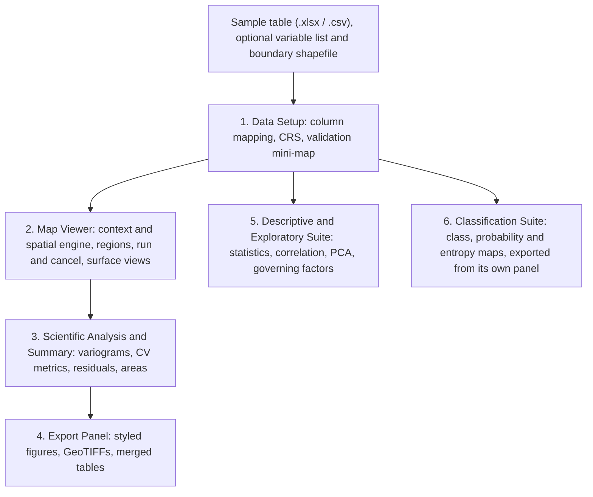

# Monolith Spatial Analysis Dashboard (v1.0.8)

[](#)
[](https://cran.r-project.org/)
[](https://shiny.posit.co/)
[](https://github.com/rserdarkara-hash/monolith/actions/workflows/tests.yaml)
[](LICENSE)
[](#1-system-prerequisites)
[](https://doi.org/10.5281/zenodo.21130951)


*Monolith* is an R Shiny application for spatial statistical analysis, geostatistical modeling, and mapping of point-referenced data. It covers the path from a sample table to a finished surface: variogram fitting, interpolation, cross-validated diagnostics, uncertainty mapping, classification, and publication-ready export. It is aimed at soil science, agronomy, and related environmental disciplines.

Whether the target is soil physicochemistry, a topographic interaction, or a management-zone map, the workflow is the same: ingest points, interpolate, validate, and export continuous or classified surfaces. Model fitting runs in parallel background workers, so the interface stays responsive while a run is in progress and long jobs can be monitored and cancelled.

## Quick Start

1. Install **R 4.5.0 or higher** (see [System Prerequisites](#1-system-prerequisites)).
2. Download or clone this repository.
3. Open `monolith.R` in RStudio and click **Run App**, or run `shiny::runApp("monolith.R")` from the project root. Missing packages install automatically on first launch, so expect a wait.
4. On the **1. Data Setup** tab, upload `sample_data/samp_data_1.xlsx` and, as the optional variable list, `samp_var_list.xlsx`. Confirm the X/Y mapping and CRS, then move to the Spatial Engine in the sidebar and run an interpolation.

The sample data carries usage restrictions until its associated manuscript is published; see [License](#license).

## Contents

- [Workflow Overview](#workflow-overview)
- [Scientific Guardrails](#scientific-guardrails)
- [Features](#features)
  - [Diverse Spatial Engine](#diverse-spatial-engine)
  - [Automated and Manual Optimization of Model Fittings](#automated-and-manual-optimization-of-model-fittings)
  - [Model Diagnostics and Validation](#model-diagnostics-and-validation)
  - [Uncertainty and Confidence Mapping](#uncertainty-and-confidence-mapping)
  - [Unified Interpolation Export Registry](#unified-interpolation-export-registry)
  - [Descriptive and Exploratory Suite](#descriptive-and-exploratory-suite)
  - [Classification Suite](#classification-suite)
  - [Regions, Run Control and Reproducibility](#regions-run-control-and-reproducibility)
  - [Dynamic UI and Theming](#dynamic-ui-and-theming)
  - [Mapping Machine Learning Predictions of Variables and Interpreting Spatial Resonance of Prediction Errors](#mapping-machine-learning-predictions-of-variables-and-interpreting-spatial-resonance-of-prediction-errors)
- [Installation and Setup Guide](#installation-and-setup-guide)
  - [1. System Prerequisites](#1-system-prerequisites)
  - [2. Getting the Code](#2-getting-the-code)
  - [3. Package Dependencies](#3-package-dependencies)
  - [4. Input Data Requirements](#4-input-data-requirements)
  - [5. Application Structure](#5-application-structure)
  - [6. Running the Application](#6-running-the-application)
- [Documentation](#documentation)
- [Testing and Reproducibility](#testing-and-reproducibility)
- [Scope and Limitations](#scope-and-limitations)
- [Development and AI Assistance](#development-and-ai-assistance)
- [Author](#author)
- [How to Cite](#how-to-cite)
- [Contributing and Support](#contributing-and-support)
- [License](#license)
- [Disclaimer](#disclaimer)

## Workflow Overview

The interface is six numbered tabs. Tabs 1 to 4 are the spine of an interpolation run, from upload to exported figure. Tabs 5 and 6 are independent analyses that need only the confirmed data table, so they can be used without ever running an interpolation.


```mermaid
flowchart TD
    U["Sample table (.xlsx / .csv), optional variable list and boundary shapefile"] --> T1
    T1["1. Data Setup: column mapping, CRS, validation mini-map"] --> T2
    T1 --> T5
    T1 --> T6
    T2["2. Map Viewer: context and spatial engine, regions, run and cancel, surface views"] --> T3
    T3["3. Scientific Analysis and Summary: variograms, CV metrics, residuals, areas"] --> T4
    T4["4. Export Panel: styled figures, GeoTIFFs, merged tables"]
    T5["5. Descriptive and Exploratory Suite: statistics, correlation, PCA, governing factors"]
    T6["6. Classification Suite: class, probability and entropy maps, exported from its own panel"]
```

1. **Data Setup.** Upload the sample table, optionally a variable list and a boundary shapefile, map the X and Y columns, declare the coordinate reference system, and confirm the mapping. The mini-map coloured by locality is the check that coordinates and CRS are right before anything is modelled.
2. **Map Viewer.** The sidebar holds the entire run configuration in two sections, **1. Context** (locality, data subset, variable category, variable, primary view) and **2. Spatial Engine** (method, auxiliary variables, boundary type, resolution, uncertainty, fitting mode and tuning). Polygons drawn on the map define regions or assign localities. **Run Interpolation** dispatches the job to background workers: the header reports the stage and per-locality progress, the run can be cancelled, and the finished surfaces are inspected here through the view switcher (actual, predicted, comparison, residual). The toolbar's vector exports also live here, because they describe what is on the map: the drawn polygons, and the class zones of the displayed surface.
3. **Scientific Analysis and Summary.** What the finished run produced for judging it: fitted variograms and per-locality parameters, cross-validation metrics under the applied CV strategy, observed-versus-predicted scatter, the directional variogram diagnostic, Regression Kriging trend coefficients, class area coverage, descriptive statistics and the run log.
4. **Export Panel.** Every map, table and plot the run registered, styled through the WYSIWYG styler and written one at a time or as a single batch, as publication figures or as georeferenced GeoTIFFs. The run configuration leaves from here as a JSON record.
5. **Descriptive and Exploratory Suite.** Distributions with significance letters, correlation including the spatial cross-correlogram, PCA, and the Governing Factors module. Driven by the uploaded table, independent of any run.
6. **Classification Suite.** Supervised multiclass classification from co-sampled covariates, with its own spatial scope, cross-validation strategy and exports. Also independent of any interpolation run.

Sidebar sections 1 and 2 configure the **next** run only. A completed run keeps the display context it was dispatched with, so changing the sidebar never silently relabels results already on screen.

## Scientific Guardrails

> **Note:** Scientific correctness is treated as Monolith's primary invariant. Rather than leaving every methodological pitfall to the user, the app builds in guardrails that block, correct, or warn against the most common ways a spatial analysis goes silently wrong. The most important ones:

* **Projected-CRS enforcement:** All interpolation runs in a projected (metric) CRS, and every grid-resolution recommendation is expressed in metres even when the analysis CRS is geographic (degree-based). For degree CRSs, nearest-neighbor distances and extents are measured via a Web Mercator projection corrected by cos(latitude), so degrees are never silently treated as metres. CRS strings are validated before any projection is attempted.

* **Resolution tied to sample support:** The suggested grid spacing is derived from your physical sampling spacing, so the mapped surface cannot fabricate fine, unmeasured detail below the resolution your sampling actually supports.

* **Extrapolation control:** A dynamic buffering engine scales boundary padding to the selected method and resolution, and a **Strict Measured** boundary type disables buffering entirely so coverage is not over-claimed far beyond sample support. In the Classification Suite, predictions are confined to per-locality boundaries and never extend into unsampled corridors between localities.

* **Kriging numerical stability (epsilon-nugget):** For near-zero-variance variables, a tiny nugget is enforced when the empirical nugget is exactly zero, preventing the singular-matrix inversion failures that would otherwise crash Kriging.

* **Variogram fitting:** Automated least-squares fitting screens four theoretical models (Spherical, Exponential, Gaussian, and Matern with fixed smoothness ν = 1.5) from four starting ranges, judging candidates on the practical range so the same sanity window means the same ground distance in every family. When no candidate qualifies it falls back to a constrained estimate, so a difficult dataset yields a stable curve instead of a crash or a nonsensical fit.

* **Multicollinearity gate (shared across modules):** A single VIF plus pairwise-correlation engine guards every covariate-driven method. Regression Kriging and Random Forest Kriging auto-drop covariates with VIF > 10 before fitting; the pre-run auxiliary-variable screen (covariate-assisted runs) and the Classification Suite flag collinear covariates (method-aware: VIF > 5 for Random Forest, VIF > 10 otherwise) and prompt you to drop or keep them; and the PCA module halts outright when any pair exceeds r > 0.95, requiring an explicit override, to protect the loading vectors from distortion.

* **Spatial cross-validation:** Spatial Block CV (k-means folds) is offered and recommended under spatial autocorrelation so error estimates are not optimistically biased by autocorrelated train/test leakage; it falls back to LOOCV below the minimum fold size. Classification uses spatially-aware resampling, and synthetic oversampling (SMOTE) is deliberately not offered because fabricated points would break the spatial-CV leakage guarantee and invent autocorrelation structure.

* **Classification scope adequacy:** Before a classification run, the scoped data are checked for sufficient sample size and per-class counts. Under-powered scopes (too few rows, or classes below the per-class minimum) raise a named warning identifying the offending classes and their counts, so unreliable rare-class results are surfaced rather than presented as trustworthy.

## Features

### Diverse Spatial Engine

Deterministic and geostatistical interpolation models for continuous and classified maps, at any scale from single fields to regional landscapes. Monolith's classification engine bins continuous predictions (e.g., Nitrogen levels) into agronomical classes whose limits you define, either from a statistical break algorithm (Jenks, k-means, equal interval) or from supervised limits you enter directly. It outputs exact area coverages (in hectares) per class.

- Inverse Distance Weighting (IDW),
- Thin Plate Splines (TPS),
- Ordinary Kriging (OK),
- Co-Kriging (CK),
- Regression Kriging (RK),
- Random Forest Kriging (RFK).


*Figure 1. One IDW surface of soil phosphorus, rendered three ways in the Map Viewer: two continuous palettes and, on the right, the same surface binned into user-defined agronomic classes.*


*Figure 2. Electrical conductivity over one field under four engines (Thin Plate Spline, Ordinary Kriging, IDW, Random Forest Kriging). The method is a sidebar choice, so the comparison costs one re-run and no reconfiguration.*

### Automated and Manual Optimization of Model Fittings

Automated least-squares fitting for variograms for four different models, Generalized Cross-Validation (GCV) for TPS, and cross-validated power optimization for IDW (folds built by the same authority as the reported metrics, so the search follows the selected cross-validation strategy). Interactive variogram fitting and manual tuning overrides are available for expert calibration. Once an interpolation run completes, each result is instantly available for batch export.


*Figure 3. Fitting controls. Left and top: manual variogram tuning (model family, nugget, partial sill, range) against the empirical semivariance cloud, with a live SSE readout and the auto-fit switch. Bottom: the Generalized Cross-Validation curve behind the TPS smoothing search, with its minimum marking the selected lambda.*

### Model Diagnostics and Validation

Evaluate models with a selectable cross-validation strategy: Auto (LOOCV for n ≤ 50, seeded random 10-fold above), full Leave-One-Out, or Spatial Block CV (k-means folds, recommended under spatial autocorrelation). Every run reports the same twelve-column panel, so two methods are always compared on identical quantities: RMSE, NRMSE (%), MAE, R² in both its correlation and its Nash-Sutcliffe (traditional) form, Bias (ME), Lin's CCC, RPD, RPIQ, SMAPE (%), and Moran's I of the cross-validation residuals with its two-sided p-value, the statistic carrying its null expectation E[I] = −1/(n − 1) on hover. The applied strategy is stated above the table, and the pooled Total (Combined) row carries a note that its R² and NSE are measured against the pooled mean. An optional repeated cross-validation re-runs the folds under 3, 5 or 10 alternative assignments and reports each metric as mean ± SD, so the spread contributed by the fold split can be read alongside the difference between two methods.

A **directional variogram** panel recomputes semivariance within four angular cones (0°/45°/90°/135° from north) on either the measured values or the run's cross-validation residuals, so directional structure can be checked instead of assumed. It is diagnostic only: every engine in the app is omnidirectional, and nothing on the map changes because of what the panel shows.


*Figure 4. The diagnostic panel of a completed run. Left: the Model Performance table, headed by the cross-validation strategy that produced it and the pooled-mean caveat that applies to Total (Combined), above the observed-versus-predicted scatter with the 1:1 line (red, dashed) against the fitted regression (blue). Right: the kriging variance surface with the sample points overlaid, the directional variogram in four bearing cones, and the fitted residual variogram.*

### Uncertainty and Confidence Mapping

The kriging engines return a prediction variance alongside the prediction, and Monolith maps it: variance and standard-error surfaces are produced for the Actual and Predicted runs alike and registered for export next to the prediction maps. For Regression and Random Forest Kriging the reported uncertainty combines the trend and residual components (RFK estimates the forest term by infinitesimal jackknife), so it is not the residual kriging variance on its own. IDW and TPS carry no comparable variance and none is invented for them. A variance surface is shown top right in Figure 4, where the lowest values track the sample points. Scientific Guide §7.

### Unified Interpolation Export Registry

Compile session assets into a centralized registry. Use the integrated WYSIWYG Styler to customize typography, DPI, and layout for publication-ready figures (PNG, TIFF, JPEG, PDF), or batch-export everything with statistical tabular data merged into an Excel file.

Results also leave as data, not only as pictures. Any single-raster surface (Actual, Predicted, Delta, interpolated point errors, and the variance and standard-error surfaces) exports as a **GeoTIFF** in the run's projected analysis CRS, with kriging surfaces written as multi-band files carrying prediction and variance. The displayed **binned class zones export as a GIS vector layer**, one dissolved polygon per class with its break limits and its area in hectares, in Shapefile, GeoJSON, KML or GeoPackage; polygons drawn on the map export the same four ways. The Classification Suite writes its class, probability and entropy surfaces as GeoTIFFs. A run's configuration downloads separately as JSON, recording the settings the run actually consumed together with the R and package versions behind it.


*Figure 5. The session registry lists every map, table and plot a run produced, each tagged with its type and timestamp. The styler previews a selected item at export typography, so what is written to file is what the preview shows.*

### Descriptive and Exploratory Suite

Understand your dataset with simultaneous descriptive, correlation, and principal component analyses with results that can be instantly generated and observed by simultaneous categorization and data popularization of choice. The correlation panel includes a **spatial cross-correlogram**, which bins point pairs by ground distance rather than by row order and shows the distance over which two variables genuinely co-vary, the co-regionalisation Co-Kriging exploits. An additional Governing Factors module computes variable importance and effects via Random Forest models with ALE, PDP, and per-observation SHAP analyses, implemented as a decoupled module for performance and modularity.


*Figure 6. Panels drawn from the four tabs of the suite: distribution and ridge plots by group, a sina plot and ANOVA boxplot carrying compact-letter significance groupings, a fitted XYZ surface, a correlation network and correlogram, a PCA biplot, and Random Forest global importance from the Governing Factors module.*

### Classification Suite

Predictive multiclass classification of categorical field states (e.g., soil/management zones) from co-sampled covariates, distinct from the spatial engine's continuous-to-zone binning. Multinomial, Random Forest, and XGBoost learners share a common preprocessing recipe and spatially-aware cross-validation, with per-class accuracy, entropy-based uncertainty mapping, and learner-aware collinearity diagnostics.


*Figure 7. The Classification Suite: target and class definition, covariate selection, spatial scope with a live in-scope point count, learner, cross-validation strategy and tuning depth on the left; predicted class map, entropy uncertainty surface, per-class probability map and permutation importance on the right.*

### Regions, Run Control and Reproducibility

* **Define regions on the map.** Draw polygons directly on the map to assign localities or analysis groups, model each region separately, and export the polygons in the GIS format of your choice. The binned class zones the model itself produces export the same way, so a management-zone map can be taken straight into a GIS or a farm-machinery workflow.
* **Watch and cancel runs.** Interpolation, classification, and governing-factors runs report their stage and per-locality progress in the header, and each can be cancelled while it is running.
* **Revisit and record runs.** Previous runs in the session are held in a Run History Archive and can be restored with their maps, tables, and settings, and the current run's configuration downloads as a JSON record of the settings and software versions it used.

### Dynamic UI and Theming

Fully responsive interface with customizable themes and figures, accessible data details on maps/graphs for visual audits of hot-points.


*Figure 8. Interactive inspection. Left: a descriptive plot opened in its expanded, hover-and-zoom view. Right: a classified surface with the point-details popup listing every measured variable at the clicked sample, grouped by variable category.*


### Mapping Machine Learning Predictions of Variables and Interpreting Spatial Resonance of Prediction Errors

> **Note:** How well machine-learning predictions agree with the true (measured) values is only half of the story: the deviations that emerge once those predictions are mapped are just as important. A model with acceptable global accuracy can still produce spatially clustered errors, and these only become visible when the predictions and their residuals are examined as surfaces.

**1. Visual Validation**

Monolith generates side-by-side "Actual" and "Predicted" surfaces. By matching the color scales, you can instantly verify if the model captures the true variance of the field or just smooths the data.


*Figure 9. Measured against machine-learning-predicted potassium, continuous (top, IDW) and binned into shared agronomic classes (bottom, Thin Plate Spline). The class version is directly comparable because both surfaces are cut at the same limits; for the continuous version, tick **Match Scales** to force one colour range across the pair.*


**2. Residual Diagnostics**

To understand the spatial structure of model errors, Monolith provides two diagnostic maps:

*Interpolated Delta (regional bias):* subtracts the predicted surface from the actual surface, so zones of consistent over- or under-prediction stand out. This is the left panel of the Map Viewer's residual view.

*Point residuals (local model failure):* the prediction error at each sampling point, drawn as discrete markers on a zero-centred diverging scale, and additionally interpolated into an error surface for export, mapping where the model fails to capture local variation.


*Figure 10. The two residual diagnostics for the same pair of measured and predicted potassium surfaces. Left: the interpolated delta between the measured and predicted surfaces. Right: the residual at each sample point on a zero-centred diverging scale, where blue and red mark under- and over-prediction and the size of a cluster of same-signed points is the sign of a spatially structured error.*


## Installation and Setup Guide

### 1. System Prerequisites

Before installing the application, ensure you have the following software installed:

*   **R:** Version **4.5.0 or higher** is required and is checked at startup; Monolith is developed and tested on **R 4.5.2**. You can download it from [CRAN](https://cran.r-project.org/).
*   **RStudio (Optional but recommended):** The easiest way to run and interact with Shiny applications. Download from [Posit](https://posit.co/download/rstudio-desktop/).
*   **System Dependencies for Spatial Packages:** The spatial stack (`sf`, `terra`) links against GDAL, GEOS and PROJ. Monolith is tested against **GDAL 3.11.4, GEOS 3.13.1 and PROJ 9.7.0**; any reasonably recent releases of these libraries will work.
    *   **Windows:** Nothing to do; CRAN ships the spatial packages as self-contained binaries. Installing [RTools](https://cran.r-project.org/bin/windows/Rtools/) (matching your R version) is only needed if a package must be compiled from source.
    *   **macOS:** You may need to install `gdal` and `proj` via Homebrew (`brew install gdal proj`).
    *   **Linux (Ubuntu/Debian):** Install spatial libraries using your package manager:
        ```bash
        sudo apt-get update
        sudo apt-get install libgdal-dev libproj-dev libgeos-dev libudunits2-dev
        ```

### 2. Getting the Code

Two equally valid ways to obtain Monolith:

*   **Download as ZIP (no Git required):** Click the green **`<> Code`** button at the top of this repository page, choose **Download ZIP**, and extract it anywhere on your machine.
*   **Clone with Git:**
    ```bash
    git clone https://github.com/rserdarkara-hash/monolith.git
    ```

### 3. Package Dependencies

Monolith depends on **60 CRAN packages** for its spatial engine, statistical analytics, and user interface, all pinned in `renv.lock` (see [Reproducible installation](#reproducible-installation-with-renv-optional)).

> [!IMPORTANT]
> **Automated Package Setup:**
> You **do not need** to execute any manual `install.packages(...)` console commands.
> Sourcing the dashboard or launching `monolith.R` automatically triggers a smart **Auto-Installation Hook** inside `global.R`. This hook scans your environment, identifies any missing packages from the required suite, and downloads them non-interactively from the cloud CRAN repository.

The full dependency suite, grouped by function:

| Category | Packages |
|---|---|
| **Core App / UI** | `shiny`, `shinyjs`, `shinyWidgets`, `shinyFiles`, `shinycssloaders`, `DT` |
| **Spatial / GIS** | `sf`, `terra`, `tidyterra`, `leaflet`, `leaflet.extras`, `ggspatial`, `fields`, `classInt`, `gstat`, `concaveman`, `spdep`, `FNN` |
| **Data Wrangling & I/O** | `dplyr`, `tidyr`, `data.table`, `jsonlite`, `readxl`, `openxlsx`, `officer`, `zip`, `fs` |
| **Visualization & Theming** | `ggplot2`, `ggpubr`, `plotly`, `RColorBrewer`, `viridis`, `patchwork`, `fresh`, `showtext`, `scales`, `commonmark`, `glue` |
| **Statistics & Machine Learning** | `randomForest`, `DALEX`, `yardstick`, `agricolae`, `mgcv`, `nortest` |
| **Classification (tidymodels)** | `parsnip`, `recipes`, `workflows`, `tune`, `rsample`, `dials`, `spatialsample`, `hardhat`, `ranger`, `xgboost`, `nnet` |
| **Parallelization / Async** | `future`, `furrr`, `promises` |
| **CRS catalogue** | `DBI`, `RSQLite` |

<details>
<summary><strong>Tested version matrix</strong>: the exact package versions Monolith 1.0.8 is developed and validated against (click to expand)</summary>

<br>

Newer CRAN releases are expected to work; if you encounter an inconsistency, matching these versions is the first troubleshooting step.

| Package | Version | Package | Version | Package | Version |
|---|---|---|---|---|---|
| `shiny` | 1.13.0 | `dplyr` | 1.2.0 | `randomForest` | 4.7-1.2 |
| `shinyjs` | 2.1.1 | `tidyr` | 1.3.1 | `DALEX` | 2.5.3 |
| `shinyWidgets` | 0.9.0 | `data.table` | 1.18.2 | `yardstick` | 1.3.2 |
| `shinyFiles` | 0.9.3 | `jsonlite` | 2.0.0 | `agricolae` | 1.3-7 |
| `shinycssloaders` | 1.1.0 | `readxl` | 1.4.5 | `mgcv` | 1.9-4 |
| `DT` | 0.34.0 | `openxlsx` | 4.2.8 | `nortest` | 1.0-4 |
| `sf` | 1.1-0 | `officer` | 0.7.3 | `future` | 1.69.0 |
| `terra` | 1.8-93 | `zip` | 2.3.3 | `furrr` | 0.3.1 |
| `tidyterra` | 1.0.0 | `fs` | 2.1.0 | `promises` | 1.5.0 |
| `leaflet` | 2.2.3 | `ggplot2` | 4.0.2 | `patchwork` | 1.3.2 |
| `leaflet.extras` | 2.0.1 | `ggpubr` | 0.6.3 | `fresh` | 0.2.2 |
| `ggspatial` | 1.1.10 | `plotly` | 4.12.0 | `showtext` | 0.9-7 |
| `fields` | 17.1 | `RColorBrewer` | 1.1-3 | `scales` | 1.4.0 |
| `classInt` | 0.4-11 | `viridis` | 0.6.5 | `commonmark` | 2.0.0 |
| `gstat` | 2.1-5 | `concaveman` | 1.2.0 | `glue` | 1.8.0 |
| `FNN` | 1.1.4 | `parsnip` | 1.4.1 | `spdep` | 1.4-2 |
| `workflows` | 1.3.0 | `tune` | 2.0.1 | `recipes` | 1.3.1 |
| `dials` | 1.4.2 | `spatialsample` | 0.6.1 | `rsample` | 1.3.2 |
| `ranger` | 0.18.0 | `xgboost` | 3.2.0.1 | `hardhat` | 1.4.2 |
| `DBI` | 1.3.0 | `RSQLite` | 2.4.1 | `nnet` | 7.3.20 |

**Runtime environment:** R 4.5.2 (ucrt) · GDAL 3.11.4 · GEOS 3.13.1 · PROJ 9.7.0 · Windows 11 (also runs on macOS and Linux).

</details>

#### Reproducible installation with `renv` (optional)

For an exact, one-command reproduction of the validated environment, the repository ships a [`renv`](https://rstudio.github.io/renv/) lockfile (`renv.lock`) pinning the dependency tree (including transitive dependencies) to the versions in the matrix above. All 60 packages listed in `global.R` are covered, the Classification Suite's tidymodels stack included. From the project root:

```r
install.packages("renv")   # once
renv::restore()             # reads renv.lock; confirm the prompt to activate the project
```

This installs the pinned versions into a project-local library without touching your global R library. It is entirely optional; the Auto-Installation Hook described above remains the default path and installs current CRAN releases instead.

### 4. Input Data Requirements

Monolith reads a single flat table of point observations, one row per sample:

*   **File format:** `.xlsx`, `.xls`, or `.csv`. The first row holds column headings.
*   **Coordinates:** one column of X (easting or longitude) and one of Y (northing or latitude), in a single coordinate reference system. Geographic coordinates within ±180/±90 are detected as EPSG:4326; projected coordinates cannot reveal their zone, so the app asks you to select or type the CRS (EPSG code, PROJ string, or WKT).
*   **Variables:** at least one numeric column to interpolate. Any further numeric columns are available as covariates for RK, RFK, and CK, and as inputs to the correlation, PCA, governing-factors, and classification modules. Covariates must be co-sampled, that is, measured at the same points as the target.
*   **Localities (optional):** a text column grouping samples into fields, sites, or farms. Each locality is modelled separately. Without one, the dataset is treated as a single region; groups can also be drawn on the map afterwards.
*   **Categorical columns (optional):** text or factor columns are the targets available to the Classification Suite and the grouping factors used by the descriptive suite.
*   **Variable list (optional):** a second file (`.xlsx`, `.xls`, `.csv`, JSON, or TXT) mapping column names to display labels, units, and categories, which is what drives the readable axis titles and the variable folders in the sidebar. See `sample_data/samp_var_list.xlsx`.
*   **Boundary shapefile (optional):** upload `.shp` together with `.shx`, `.dbf`, and `.prj` to clip surfaces to a known field boundary.

The Data Setup tab validates the mapping before anything is modelled: a mini-map colours the points by locality so a swapped X/Y pair or a wrong CRS is visible immediately. See the [User Guide](docs/user_guide.md) for the full ingestion walkthrough.

### 5. Application Structure

Ensure your project directory maintains the following structure. The application consists of a centralized package loader, a main runner file, and several helper scripts:

```
monolith/
│
├── global.R                          # Centralized package loader & environment configuration
├── monolith.R                        # Main Application Runner (assembles UI + server from the files below)
├── global_utils.R                    # Static configuration & pure utility functions
│
├── ui_main.R                         # Master UI assembly (fluidPage skeleton)
├── ui_sidebar.R                      # Sidebar panel definition
├── ui_main_tabs.R                    # Main tab panel definition
│
├── server_setup.R                    # Session infrastructure, caches & central reactive state
├── server_export.R                   # Export registry, styler & batch export handlers
├── server_map_interactions.R         # Draw tools, popups & point styling
├── server_data_setup.R               # Upload, CRS parsing & variable mapping
├── server_run_config.R               # Display context, config persistence & selectors
├── server_model_tuning.R             # TPS/IDW optimization & variogram tuning
├── server_execution.R                # Parallel interpolation pipeline (future/furrr)
├── server_map_viewer.R               # Leaflet map rendering & proxy overlays
├── server_sci_analysis.R             # Diagnostics, metrics & results tables
│
├── spatial_helpers.R                 # Geostatistical core loader (sources the four spatial_* files)
├── spatial_vgm.R                     # Variogram fitting machinery
├── spatial_metrics.R                 # CV folds, error metrics & Moran's I
├── spatial_kriging.R                 # Interpolation engines (IDW/TPS/OK/CK/RK/RFK)
├── spatial_pipeline.R                # Regional orchestration & parallel worker entry points
│
├── ui_helpers.R                      # UI/analytics helper loader (sources the four ui_* helper files)
├── ui_colors.R                       # Palettes & colour resolution
├── ui_formatting.R                   # Labels, metadata matching & fuzzy matching helpers
├── ui_components.R                   # Shiny widget/tag generators
├── ui_plotting.R                     # Descriptive, correlation, PCA & diagnostic plot builders
│
├── theme_helpers.R                   # Theming & export configurations
├── gov_module.R                      # Governing Factors UI & Server Modules
├── desc_exploratory_module.R         # Descriptive & Exploratory Suite (Tab 5 Module)
├── classif_helpers.R                 # Supervised classification engine (tidymodels)
├── classif_module.R                  # Classification Suite UI & Server Module (Tab 6)
│
├── assets/                           # Screenshots & static assets
├── docs/                             # User, scientific & module guides
├── sample_data/                      # Demo datasets (restricted license)
├── tests/                            # testthat unit & regression test suite
├── .github/workflows/                # Continuous integration (runs the test suite)
│
├── DESCRIPTION                       # Package metadata; the version the app reads at startup
├── renv.lock                         # Pinned dependency tree for renv::restore()
├── CITATION.cff                      # Machine-readable citation metadata
├── README.MD                         # This document
├── CHANGELOG.md                      # Version history of notable changes
├── LICENSE                           # GPL-3.0 license
└── .gitignore
```

### 6. Running the Application

#### Option A: Using RStudio (Recommended)
1. Open the `monolith.R` file in RStudio.
2. Ensure all required packages are installed and loaded without errors.
3. Click the **"Run App"** button located at the top right of the source editor.

#### Option B: Using the R Console
1. Open your R console or terminal.
2. Set your working directory to the folder containing the app:
   ```R
   setwd("/path/to/your/monolith/directory")
   ```
3. Launch the Shiny app:
   ```R
   shiny::runApp("monolith.R")
   ```

On first launch, expect a delay while the Auto-Installation Hook downloads any missing packages; subsequent launches are fast.

## Documentation

Detailed guides live in the [docs/](docs/) directory:

| Guide | Contents |
|---|---|
| [User Guide](docs/user_guide.md) | End-to-end walkthrough: data ingestion, interpolation workflow, export registry |
| [Scientific Guide](docs/scientific_guide.md) | Mathematical formulation of the interpolation engines, variogram fitting, cross-validation metrics and the supervised classification methodology |
| [Descriptive & Exploratory Guide](docs/desc_exploratory_guide.md) | Descriptive statistics, correlation, PCA and the Governing Factors module |

Sample datasets in [sample_data/](sample_data/) let you exercise every module without your own data (see [License](#license) for their usage restrictions).

## Testing and Reproducibility

Monolith ships with a `testthat` suite of 2,313 assertions across 32 test files, covering the interpolation pipeline, cross-validation metrics, variogram fitting, the classification engine, the descriptive/correlation/PCA plot builders, metadata matching and the Governing Factors module. Where a quantity has an external or closed-form reference, the tests assert against that rather than against the app's own output: Lin's CCC against a value computed independently with `DescTools`, NSE and RMSE against known-answer fixtures, and the plotted variogram curves against `gstat::variogramLine`. A separate file boots the assembled application in a headless browser through `shinytest2` and checks the shell (server initialisation, input identifiers, tab wiring, documentation drawer); it skips itself when `shinytest2` or a Chromium-based browser is unavailable. The suite runs on every push through GitHub Actions against the pinned `renv.lock` environment. To run everything from the project root:

```bash
Rscript tests/testthat.R
```

The first run is slow because the harness sources the full application (all 60 packages); this is expected. Scientific accuracy is treated as the project's primary invariant; changes that alter numeric results are gated on these tests.

## Scope and Limitations

Stating what the application does not do is part of using it correctly:

*   **Two-dimensional, point-referenced data only.** There is no depth or 3D interpolation and no space-time modelling; a time series is handled by mapping each date separately.
*   **All interpolation engines are omnidirectional.** Anisotropy can be diagnosed (see the directional variogram panel) but not modelled: no anisotropic variogram, no directional search neighbourhood.
*   **One nugget plus one structure per variogram**, fitted by weighted least squares with Matern smoothness fixed at ν = 1.5. Nested structures, REML or maximum-likelihood fitting, and free smoothness estimation are out of scope.
*   **Covariates are table columns, not rasters.** RK, RFK, and CK take covariates co-sampled at the observation points and krige them onto the prediction grid; external raster stacks (DEM derivatives, satellite bands) are not read directly and must be sampled to the points beforehand. The resulting covariate surfaces are themselves interpolations, and their error propagates into the prediction (Scientific Guide §10.4).
*   **Uncertainty is model-based.** The mapped variance is the kriging variance under the fitted model, not a posterior from a Bayesian formulation and not a conditional-simulation ensemble; it inherits every assumption the variogram makes and does not account for uncertainty in the variogram fit itself.
*   **Classification is limited to three learners** (multinomial, Random Forest, XGBoost) on tabular covariates, with no synthetic oversampling by design (see [Guardrails](#scientific-guardrails)).
*   **Single-user desktop application.** It is designed for one analyst on one machine, with parallel workers on local cores. It is not hardened for multi-user server deployment, and the run-duration history is not synchronised across concurrent sessions.
*   **Not a GIS.** There is no digitizing, topology editing, raster algebra, or general layer management beyond what the analysis itself needs.

## Development and AI Assistance

Monolith was built with AI-assisted development tools and is disclosed here in the interest of scientific transparency: the codebase was structured into a Shiny App with **Antigravity CLI** (Google DeepMind), then systematically audited and refined with **Claude Code (Fable 5; Anthropic)**, covering debugging, performance optimization, and line-by-line verification of the mathematical implementations (interpolation engines, variogram fitting, cross-validation metrics).

Human oversight remained central throughout: all methodological choices, model formulations, and scientific decisions were specified, reviewed, and validated by the author. Numeric behavior is guarded by the `testthat` suite described [above](#testing-and-reproducibility), and any change that alters numeric results is treated as a scientific decision requiring explicit justification. Responsibility for the correctness of the software rests with the author, not the tools. This disclosure mirrors the statement in the associated publication (Kara et al., 2026).

## Author

**R. Serdar Kara** ([ORCID: 0000-0003-1297-2328](https://orcid.org/0000-0003-1297-2328))

## How to Cite

```bibtex
@software{monolith2026,
  title     = {Monolith: A Spatial Analysis Dashboard for Geostatistical Modeling and Mapping},
  author    = {Kara, R. Serdar},
  year      = {2026},
  version   = {1.0.8},
  doi       = {10.5281/zenodo.21130951},
  publisher = {Zenodo},
  url       = {https://github.com/rserdarkara-hash/monolith},
  note      = {R Shiny application, GPL-3.0}
}
```

The same reference is available from GitHub's **Cite this repository** button, which reads the [`CITATION.cff`](CITATION.cff) file in the repository root. The DOI above is the **concept DOI** and always resolves to the latest release; Zenodo also mints a version-specific DOI for each release, which is the one to cite when the exact version matters for reproducing a result.

## Contributing and Support

*   **Bug reports & feature requests:** Please open an [Issue](../../issues) on this repository. Include your R version, operating system, and a minimal description of the steps that reproduce the problem.
*   **Questions:** The [Discussions](../../discussions) tab (if enabled) or an Issue are both fine.
*   **Pull requests:** Contributions are welcome under the GPL-3.0 terms. Please make sure the test suite passes (`Rscript tests/testthat.R`) before submitting, and note that any change altering numeric results of the spatial models or metrics requires scientific justification in the PR description.

## License

This project uses a dual-licensing structure, one license for the software and a separate one for the bundled sample data:

*   **Software & Source Code**: The core codebase of **Monolith** is licensed under the **GNU General Public License v3.0 (GPL-3.0)**. You are free to run, study, share, and modify the software, provided all derivative works remain open-source under the same terms. See the [LICENSE](LICENSE) file for the full legal text.

*   **Sample Data**: `samp_data_1.xlsx` and its variable list `samp_var_list.xlsx` in [sample_data/](sample_data/) are **not** covered by the GPL-3.0. They accompany a manuscript submitted for peer review and are provided strictly for demonstration, evaluation, and testing of the Monolith application. They are **not** licensed for third-party use until that manuscript is formally published, at which point they will be released under [Creative Commons Attribution 4.0 International (CC BY 4.0)](https://creativecommons.org/licenses/by/4.0/). Until then all rights are reserved and the restrictions apply to all third parties. The full terms are in [sample_data/DATA_LICENSE](sample_data/DATA_LICENSE).

## Disclaimer

Monolith is provided **"as is"**, without warranty of any kind, express or implied, including, but not limited to, warranties of merchantability, fitness for a particular purpose, and non-infringement, as set out in Sections 15 and 16 of the [GPL-3.0 license](LICENSE). In no event shall the author be liable for any claim, damages, or other liability arising from the use of this software.

In particular, for scientific and applied use: the quality of any interpolation, classification, or statistical output depends on the input data, sampling design, and model assumptions you choose. **You are responsible for validating the results for your own application**, including any agronomic, environmental, or management decision informed by them. The diagnostic tools built into Monolith (cross-validation metrics, residual maps, variogram inspection) exist precisely to support that validation; please use them.
