# Monolith Spatial Analysis Dashboard (v1.1.4)

[](#)
[](https://cran.r-project.org/)
[](https://shiny.posit.co/)
[](https://github.com/rserdarkara-hash/monolith/actions/workflows/tests.yaml)
[](https://github.com/rserdarkara-hash/monolith/actions/workflows/upstream.yaml)
[](LICENSE)
[](#1-system-prerequisites)
[](https://doi.org/10.5281/zenodo.21130951)


*Monolith* is an R Shiny application for spatial statistical analysis, geostatistical modeling, and mapping of point-referenced data. It covers the path from a sample table to a finished surface: variogram fitting, interpolation, cross-validated diagnostics, uncertainty mapping, classification, and publication-ready export. It is aimed at soil science, agronomy, and related environmental disciplines.

Whether the target is soil physicochemistry, a topographic interaction, or a management-zone map, the workflow is the same: ingest points, interpolate, validate, and export continuous or classified surfaces. Model fitting runs in parallel background workers, so the interface stays responsive while a run is in progress and long jobs can be monitored and cancelled.

## Quick Start

1. Install **R 4.5.0 or higher** (see [System Prerequisites](#1-system-prerequisites)).
2. Download or clone this repository.
3. Open `monolith.R` in RStudio and click **Run App**, or run
   `shiny::runApp("monolith.R", launch.browser = TRUE)` from the project root.

   **Run it in a real browser, not the RStudio viewer pane.** The embedded
   viewer renders Leaflet maps, large tables, and raster overlays noticeably
   more slowly. Either launch from an R console or a terminal, which opens your
   system browser by default, or in RStudio set the **Run App** dropdown to
   *Run External*.
4. On the **Data Setup** tab, upload `sample_data/samp_data_1.xlsx` and, as the variable list, `samp_var_list.xlsx` (optional but recommended for your own data; required for proper investigation of the sample data). Confirm the X/Y mapping and CRS, then move to the Spatial Engine in the sidebar and run an interpolation. The sample file arrives ready to run, with **Locality** preset to Kale and Yorga, the two localities the accompanying manuscript examines in detail, and both CRS selectors preset to `EPSG:32635` (UTM 35N), in which those localities lie. Clear the Locality box to map all seven. These presets are keyed on the sample file's own name and never apply to a dataset of your own.

The sample data carries usage restrictions until its associated manuscript is published; see [License](#license).

## Contents

- [Workflow Overview](#workflow-overview)
- [Scientific Guardrails](#scientific-guardrails)
- [Features](#features)
  - [Diverse Spatial Engine](#diverse-spatial-engine)
  - [Automated and Manual Optimization of Model Fittings](#automated-and-manual-optimization-of-model-fittings)
  - [Model Diagnostics and Validation](#model-diagnostics-and-validation)
  - [Uncertainty and Confidence Mapping](#uncertainty-and-confidence-mapping)
  - [Unified Interpolation Export Registry](#unified-interpolation-export-registry)
  - [Descriptive and Exploratory Suite](#descriptive-and-exploratory-suite)
  - [Classification Suite](#classification-suite)
  - [Regions, Run Control and Reproducibility](#regions-run-control-and-reproducibility)
  - [Dynamic UI and Theming](#dynamic-ui-and-theming)
  - [Mapping Machine Learning Predictions of Variables and Interpreting Spatial Resonance of Prediction Errors](#mapping-machine-learning-predictions-of-variables-and-interpreting-spatial-resonance-of-prediction-errors)
- [Installation and Setup Guide](#installation-and-setup-guide)
  - [1. System Prerequisites](#1-system-prerequisites)
  - [2. Getting the Code](#2-getting-the-code)
  - [3. Package Dependencies](#3-package-dependencies)
  - [4. Input Data Requirements](#4-input-data-requirements)
  - [5. Application Structure](#5-application-structure)
  - [6. Running the Application](#6-running-the-application)
- [Documentation](#documentation)
- [Testing and Reproducibility](#testing-and-reproducibility)
- [Scope and Limitations](#scope-and-limitations)
- [Development and AI Assistance](#development-and-ai-assistance)
- [Author](#author)
- [How to Cite](#how-to-cite)
- [Contributing and Support](#contributing-and-support)
- [License](#license)
- [Disclaimer](#disclaimer)

## Workflow Overview

The interface consists of six tabs. Tabs on the left form the spine of an interpolation run, from upload to exported figure. Tabs in the middle and on the right are independent analyses that need only the confirmed data table, so they can be used without ever running an interpolation.

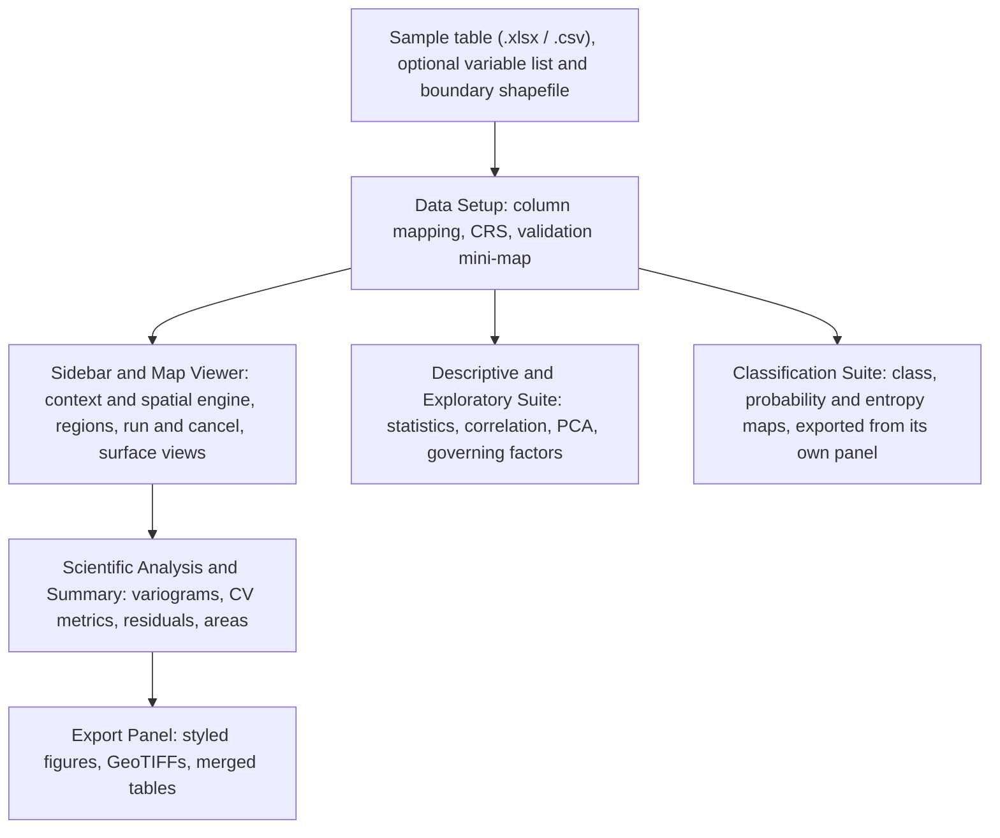
```mermaid
flowchart TD
    U["Sample table (.xlsx / .csv), optional variable list and boundary shapefile"] --> T1
    T1["Data Setup: column mapping, CRS, validation mini-map"] --> T2
    T1 --> T5
    T1 --> T6
    T2["Sidebar and Map Viewer: context and spatial engine, regions, run and cancel, surface views"] --> T3
    T3["Scientific Analysis and Summary: variograms, CV metrics, residuals, areas"] --> T4
    T4["Export Panel: styled figures, GeoTIFFs, merged tables"]
    T5["Descriptive and Exploratory Suite: statistics, correlation, PCA, governing factors"]
    T6["Classification Suite: class, probability and entropy maps, exported from its own panel"]
```

**Data Setup:** Upload the sample table, optionally a variable list and a boundary shapefile, map the X and Y columns, declare the coordinate reference system, and confirm the mapping. The mini-map coloured by locality is the check that coordinates and CRS are right before anything is modelled.

**Sidebar and Map Viewer:** The sidebar holds the entire run configuration in five sections: **Context** (locality, data subset, variable category, variable, primary view), **Spatial Engine** (method, cross-validation design, auxiliary variables, fitting mode and tuning), **Domain & Grid** (boundary type, buffer, resolution), **Map Styling**, and **Session** (save and load the configuration). Polygons drawn on the map define regions or assign localities. **Run Interpolation** dispatches the job to background workers: the header reports the stage and per-locality progress, the run can be cancelled, and the finished surfaces are inspected here through the view switcher (actual, predicted, comparison, residual, and for a kriging run the standard-error and variance map of each surface). 

The dashboard sidebar configures the **next** run, but you can change styling at any time or match the scales of comparison runs. A completed run keeps the display context it was dispatched with.

**Scientific Analysis and Summary:** What the finished run produced for judging it: fitted variograms and per-locality parameters, cross-validation metrics under the applied CV strategy, observed-versus-predicted scatter for interpolated surfaces, the directional variogram diagnostic, Regression Kriging trend coefficients, class area coverage, descriptive statistics for the area interpolated, the run log and more.

**Export Panel:** Every map, table and plot the run registered, styled through the WYSIWYG styler and written one at a time or as a single batch, as publication figures or as georeferenced GeoTIFFs. The run configuration can be captured from here as a JSON record.

**Descriptive and Exploratory Suite:** Distributions with significance letters, correlation including the spatial cross-correlogram, PCA, and the Governing Factors module. Driven by the uploaded table, independent of any run.

**Classification Suite:** Supervised multiclass classification from co-sampled covariates, with its own spatial scope, cross-validation strategy, entropy/probability maps, and exports. Also independent of any interpolation run.


## Scientific Guardrails

> **Note:** Rather than leaving every methodological pitfall to the user, the app builds in guardrails that block, correct, or warn against the most common ways a spatial analysis goes silently wrong. The most important ones:

* **Projected-CRS enforcement:** All interpolation runs in a projected (metric) CRS, and every grid-resolution recommendation is expressed in metres even when the analysis CRS is geographic (degree-based). For degree CRSs, nearest-neighbor distances and extents are measured via a Web Mercator projection corrected by cos(latitude), so degrees are never silently treated as metres. CRS strings are validated before any projection is attempted.

* **Grid resolution and sample support, stated apart:** The suggested grid spacing is half the mean nearest-neighbour distance of your samples, and the dynamic boundary buffer scales with that same spacing, so padding never claims coverage the sampling does not support. An Auto run grid follows each locality's sampling density (Hengl 2006: 0.0791 × √(area / samples), about 160 cells per sample, never coarser than that half-spacing, limited to 1-1000 m); **Auto (Global)** gives every locality the finest of those sizes on one shared lattice, and the size each locality was gridded at is reported after the run. Fixed resolution is the cell size you set yourself.

* **Extrapolation control:** A dynamic buffering engine scales boundary padding to the selected method and resolution, and a **Point buffer** boundary type disables buffering entirely so coverage is not over-claimed far beyond sample support. In the Classification Suite, predictions are confined to per-locality boundaries and never extend into unsampled corridors between localities.

* **Kriging numerical safeguards:** Near-constant targets are recognized as having no meaningful spatial variance rather than being presented as fitted spatial structure. Non-finite kriging predictions and variances are discarded, and a surface with no valid predictions is skipped with a warning instead of breaking the run.

* **Variogram fitting:** Auto-Fit compares four theoretical models across multiple starting ranges and selects the best eligible converged fit by weighted least-squares error. A range extending beyond the sampled lag window does not invalidate the fit; instead, Monolith flags weakly resolved range or sill estimates, while singular fits and heuristic fallbacks are used only when stronger fits are unavailable.

* **Multicollinearity gate (shared across modules):** A single VIF plus pairwise-correlation engine guards every covariate-driven method. Before a Regression Kriging, Random Forest Kriging or Co-Kriging run, covariates above VIF 10 within the selected localities are named and you drop them or keep them all, and every cross-validation fold applies the same rule to its own training samples; the Classification Suite flags collinear covariates the same way (VIF > 5 for its Random Forest, VIF > 10 otherwise). Before a PCA, pairs of variables correlated above |r| = 0.95 are named, because a near-duplicate pair weights one direction twice in the components, and the PCA runs once you remove one of each pair or confirm the selection.

* **Cross-validation that says what it measures:** LOOCV and random folds keep each held-out point's neighbours in the training data, as the map does, and estimate the accuracy of interpolation within the sampled area, approximately without bias for a simple random sample (Wadoux et al. 2021) and conservatively for a regular grid, where a held-out point is a full grid spacing from its neighbours. Spatial Block CV (k-means folds) holds out contiguous regions and estimates accuracy away from the sampled clusters, which addresses the key question of model transferability to unsampled ground (Roberts et al. 2017; Ploton et al. 2020); it falls back to LOOCV below the minimum fold size. kNNDM matches the folds to the map's own prediction distances inside its boundary (Linnenbrink et al. 2024): random folds where they already match, spatially grouped folds where the map predicts farther from the samples, and the CV Distance Match panel shows how closely any design's folds match the map. Classification uses spatially aware resampling, and synthetic oversampling (SMOTE) is deliberately not offered because fabricated points would break the spatial-CV leakage guarantee and invent autocorrelation structure.

* **Classification scope adequacy:** Before a classification run, the scoped data are checked for sufficient sample size and per-class counts. Under-powered scopes (too few rows, or classes below the per-class minimum) raise a named warning identifying the offending classes and their counts, so unreliable rare-class results are surfaced rather than presented as trustworthy.

## Features

### Diverse Spatial Engine

Deterministic and geostatistical interpolation models for continuous and classified maps, at any scale from single fields to regional landscapes. Monolith’s classification engine bins continuous predictions (such as nitrogen levels) into custom or default agronomic classes. Class boundaries can be defined using statistical binning algorithms (Jenks, k-means, equal interval) or explicit user-defined limits, generating spatial coverage metrics (in hectares) per class.

- Inverse Distance Weighting (IDW),
- Thin Plate Splines (TPS),
- Ordinary Kriging (OK),
- Co-Kriging (CK), heterotopic: a covariate also enters from locations where the target was not measured, such as a dense conductivity survey beside fewer laboratory samples,
- Regression Kriging (RK),
- Random Forest Kriging (RFK).

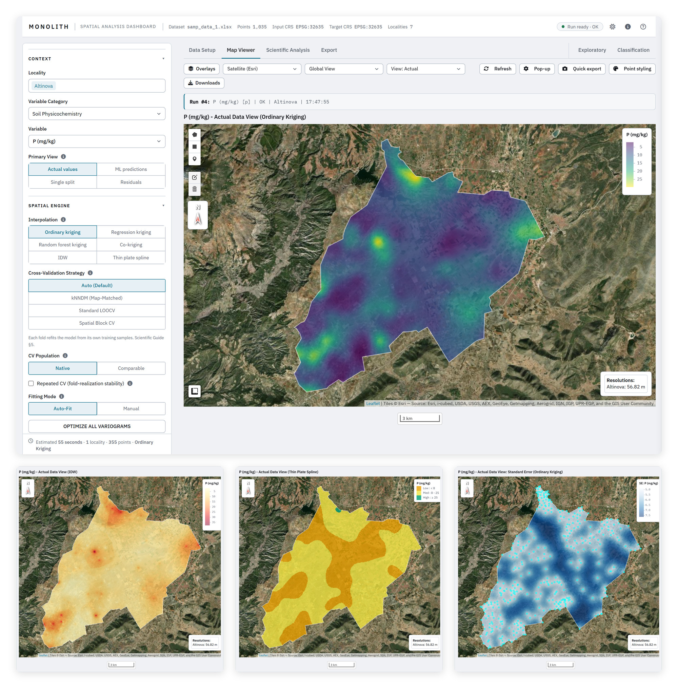

*Figure 1. The Map Viewer on one locality (soil phosphorus, 355 samples): an Ordinary Kriging surface in the main view; beneath it, the same variable by IDW with its power chosen by cross-validation, by Thin Plate Spline binned into three agronomic classes at supervised limits, and the Ordinary Kriging standard-error surface with the sample points.*

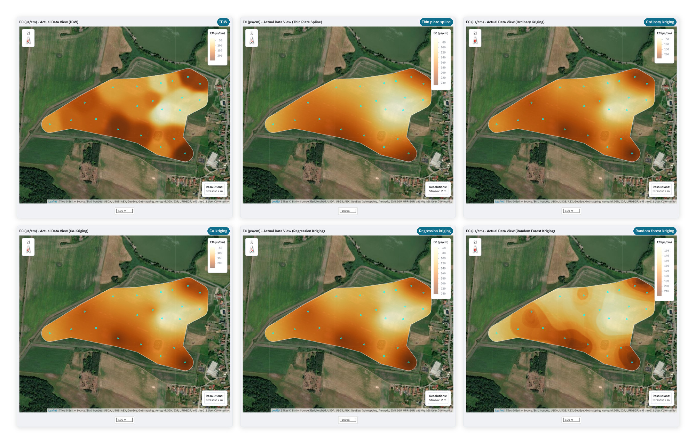

*Figure 2. One 21-sample field (electrical conductivity) under all six engines: IDW, Thin Plate Spline, Ordinary Kriging, Co-Kriging, Regression Kriging and Random Forest Kriging. A Buffered boundary carries each surface 50 m beyond the samples (about half their mean spacing), and each panel keeps its own legend range, so compare patterns rather than colours across panels. The method is a sidebar choice, so the comparison costs one re-run and no reconfiguration.*

### Automated and Manual Optimization of Model Fittings

Automated least-squares fitting of four variogram models, Generalized Cross-Validation (GCV) for the TPS smoothing and cross-validated selection of the IDW power (under the selected cross-validation strategy), each made inside the run and repeated inside every cross-validation fold, so the reported metrics include the selection. Fixed values can be set for all localities or per locality, and interactive variogram fitting serves expert calibration. Once an interpolation run completes, each result is instantly available for batch export.

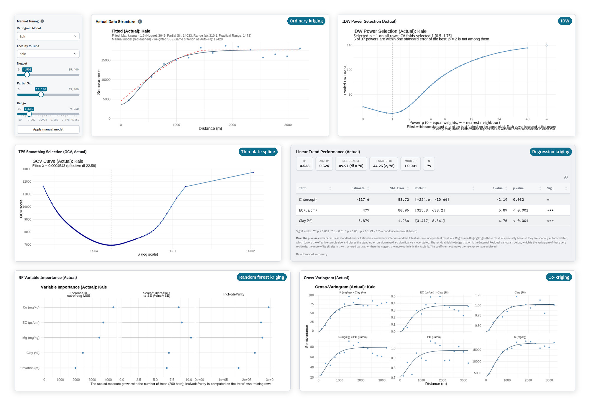

*Figure 3. How each engine fits, on one dataset (potassium, 79 samples). Ordinary Kriging: manual variogram tuning (model, nugget, partial sill, range) drawn dashed over the automatic fit and scored by the same weighted SSE. IDW: the cross-validated RMSE of every candidate power, from equal weights to the nearest-neighbour limit, with the selected power marked. Thin Plate Spline: the GCV curve and its minimum. Regression Kriging: the trend's fit statistics and coefficient table. Random Forest Kriging: covariate importance by three measures. Co-Kriging: the direct and cross-variograms of the fitted linear model of coregionalisation.*

### Model Diagnostics and Validation

Evaluate models with a selectable cross-validation strategy: Auto (LOOCV for n ≤ 50, seeded random 10-fold above), kNNDM (ten folds matched to the map's own prediction distances; Linnenbrink et al. 2024), full Leave-One-Out, or Spatial Block CV (k-means folds, for accuracy away from the sampled clusters). Every run reports the same thirteen-column panel, so two methods are always compared on identical quantities: RMSE, NRMSE (mean, %), NRMSE (SD), MAE, R² in both its correlation and its Nash-Sutcliffe (traditional) form, Bias (ME), Lin's CCC, RPD, RPIQ, SMAPE (%), and Moran's I of the cross-validation residuals with its two-sided permutation p-value, the statistic carrying its null expectation E[I] = −1/(n − 1) on hover. The applied strategy is stated above the table, and multi-locality runs offer a pooled Total (Combined) row with a note that its R² and NSE are measured against the pooled mean. An optional repeated cross-validation re-runs the folds under 3, 5 or 10 alternative assignments and reports each metric as mean ± SD, so the spread contributed by the fold split can be read alongside the difference between two methods.

A **directional variogram** panel recomputes semivariance within four angular cones (0°/45°/90°/135° from north) on the measured values, on an uploaded ML prediction column, or on the cross-validation residuals of either surface, so directional structure can be checked instead of assumed. It is diagnostic only: every engine in the app is omnidirectional, and nothing on the map changes because of what the panel shows.

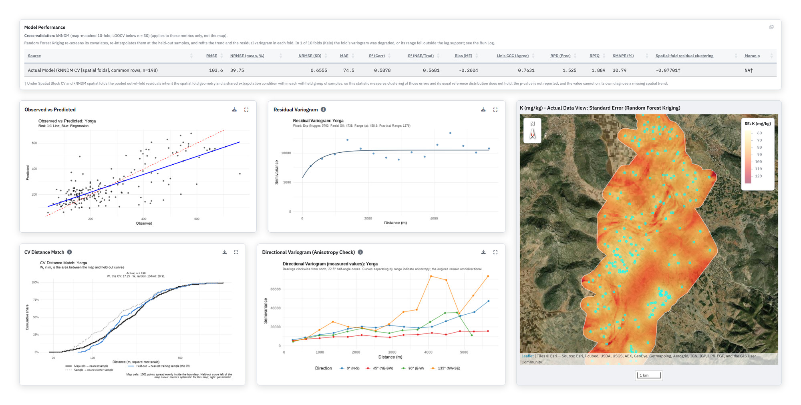

*Figure 4. The diagnostics of one Random Forest Kriging run (two localities, kNNDM cross-validation, Buffered boundary), shown for one locality. Top: the Model Performance table under the strategy that produced it, with the note on why the residual-clustering p-value is not reported under spatial folds. Left: observed against predicted with the 1:1 line (red, dashed) and the fitted regression (blue); the residual variogram; the CV Distance Match, where the held-out distances follow the map's own prediction distances (W, the area between the curves, for these folds and for random 10-fold); and the directional variogram in four bearing cones. Right: the standard-error surface with the sample points.*

### Uncertainty and Confidence Mapping

The kriging engines return a prediction variance alongside the prediction, and Monolith maps it: variance and standard-error surfaces are produced for the runs and registered for export next to the interpolation maps. For Regression and Random Forest Kriging the reported uncertainty combines the trend and residual components (RFK estimates the forest term by infinitesimal jackknife), so it is not the residual kriging variance on its own. Standard-error surfaces appear at the bottom right of Figure 1 (Ordinary Kriging, lowest beside the samples) and on the right of Figure 4 (Random Forest Kriging).

### Unified Interpolation Export Registry

Compile session assets into a centralized registry. Use the integrated WYSIWYG Styler to customize typography, DPI, and layout for publication-ready figures (PNG, TIFF, JPEG, PDF), or batch-export everything with statistical tabular data merged into an Excel file.

Results also leave as data, not only as pictures. Any single-raster surface (Actual, Predicted, Delta, interpolated point errors, and the variance and standard-error surfaces) exports as a **GeoTIFF** in the run's projected analysis CRS, with kriging surfaces written as multi-band files carrying prediction and variance. Each band stores its real statistics (minimum, maximum, mean, standard deviation, valid share), and the file names its run in metadata tags inside the `.tif`: `MONOLITH_VARIABLE`, `MONOLITH_UNIT`, `MONOLITH_PRODUCT`, `MONOLITH_METHOD`, `MONOLITH_LOCALITY`, `MONOLITH_RUN_ID`, `MONOLITH_APP_VERSION`, `MONOLITH_TARGET_CRS` and `MONOLITH_CREATED`. The displayed **binned class zones export as a GIS vector layer**, one dissolved polygon per class with its break limits and its area in hectares, in Shapefile, GeoJSON, KML or GeoPackage; polygons drawn on the map export the same four ways. The Classification Suite writes its class, probability and entropy surfaces as GeoTIFFs; the class raster downloads as a zip holding `predicted_class.tif`, its `predicted_class.tif.aux.xml` (the class names GIS software reads beside the file) and `predicted_class_legend.csv` (`ID,class`). A run's configuration downloads separately as JSON, recording the settings the run actually consumed together with the R and package versions behind it.

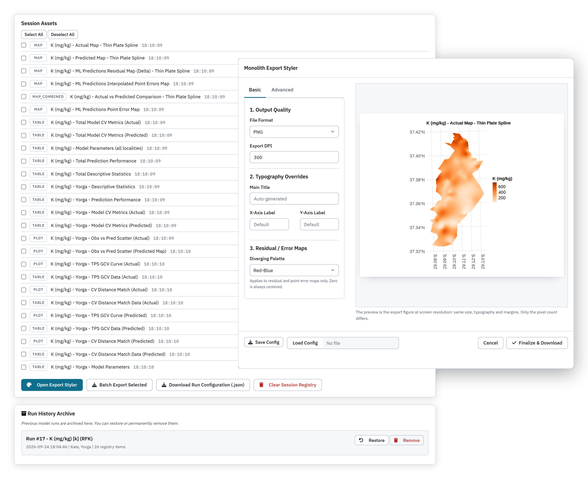

*Figure 5. The session registry lists every map, table and plot a run produced, each tagged with its type and timestamp, above the Run History Archive. The Export Styler opens over it and previews the selected item at export typography, so what is written to file is what the preview shows.*

### Descriptive and Exploratory Suite

Understand your dataset through simultaneous descriptive, correlation, and principal component analyses, with results generated instantly and visualized using the grouping and categorization options of your choice. The correlation panel includes a **spatial cross-correlogram**, which bins point pairs by ground distance rather than by row order and shows the distance over which two variables genuinely co-vary, the co-regionalisation Co-Kriging exploits. An additional Governing Factors module computes variable importance and effects via Random Forest models with ALE, PDP, and per-observation SHAP analyses, implemented as a decoupled module for performance and modularity.

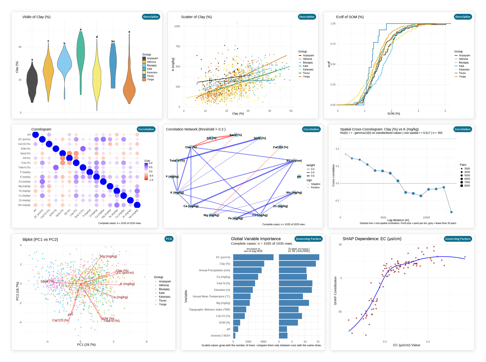

*Figure 6. The suite on the whole sample set (1,035 samples, seven localities). Top: clay by locality with Tukey HSD compact letters, potassium against clay with a linear fit per locality, and the empirical cumulative distribution of SOM. Middle: a correlogram of sixteen soil variables, the correlation network above |r| = 0.3, and the spatial cross-correlogram of clay and potassium within one locality. Bottom: a PCA biplot, and the Random Forest importance of potassium's governing factors with the SHAP dependence of the leading one.*

### Classification Suite

Predictive multiclass classification of categorical field states (e.g., soil/management zones) from co-sampled covariates, distinct from the spatial engine's continuous-to-zone binning. Multinomial, Random Forest, and XGBoost learners share a common preprocessing recipe and spatially aware cross-validation, with per-class accuracy, entropy-based uncertainty mapping, and learner-aware collinearity diagnostics.

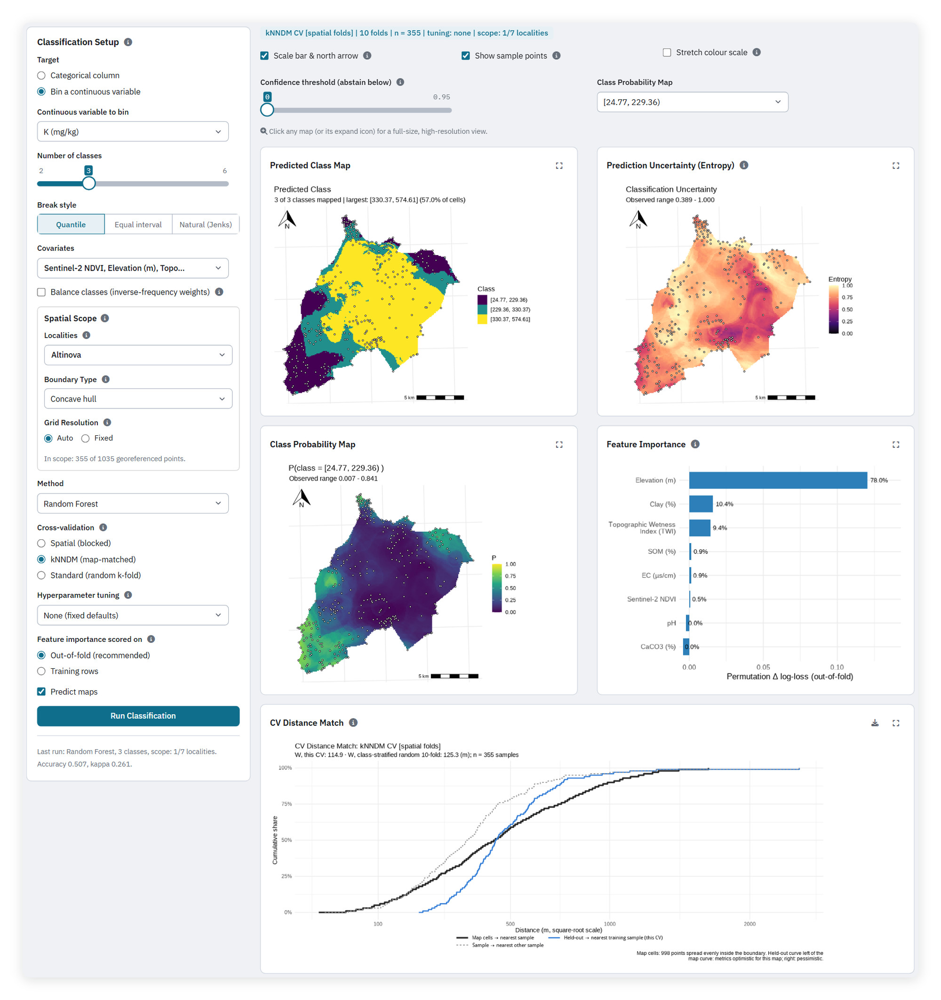

*Figure 7. The Classification Suite on potassium binned into three quantile classes over one locality (Random Forest, kNNDM cross-validation). Left: target and class definition, covariates, spatial scope with a live in-scope point count, learner, cross-validation strategy and tuning depth. Right: the predicted class map, the entropy uncertainty surface and a class-probability map, each with scale bar, north arrow and the samples; the out-of-fold permutation importance; and the CV Distance Match of the folds.*

### Regions, Run Control and Reproducibility

* **Define regions on the map.** Draw polygons directly on the map to assign localities or analysis groups, model each region separately, and export the polygons in the GIS format of your choice. The binned class zones the model itself produces export the same way, so a management-zone map can be taken straight into a GIS or a farm-machinery workflow.
* **Watch and cancel runs.** Interpolation, classification, and governing-factors runs report their stage and per-locality progress in the header, and each can be cancelled while it is running.
* **Revisit and record runs.** Previous runs in the session are held in a Run History Archive and can be restored with their maps, tables, and settings, and the current run's configuration downloads as a JSON record of the settings and software versions it used.

### Dynamic UI and Theming

Monolith provides a fully responsive interface with dark/light themes, interactive figures that can be expanded for detailed numerical examination, and accessible data details on maps and graphs for visual audits of hotspots.

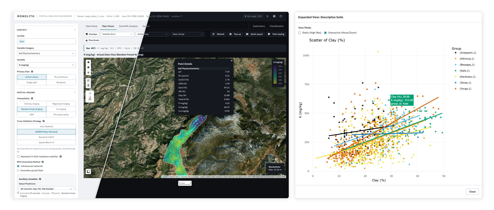

*Figure 8. Theming and interactive inspection. Left: one Map Viewer state in the light and the dark theme, split along the diagonal, with the point-details popup listing the measured variables at the clicked sample by category. Right: a descriptive plot in its expanded interactive view, with a hover readout.*


### Mapping Machine Learning Predictions of Variables and Interpreting Spatial Resonance of Prediction Errors

> **Note:** How well machine-learning predictions agree with the true (measured) values is not the sole criterion: the deviations that emerge once those predictions are mapped are also important. A model with acceptable global accuracy can still produce spatially clustered errors, and these only become visible when the predictions and their residuals are examined as surfaces.

**1. Visual Validation**

Monolith generates side-by-side "Actual" and "Predicted" surfaces. By matching the color scales, you can instantly verify if the model captures the true variation in the field or just smooths the data.

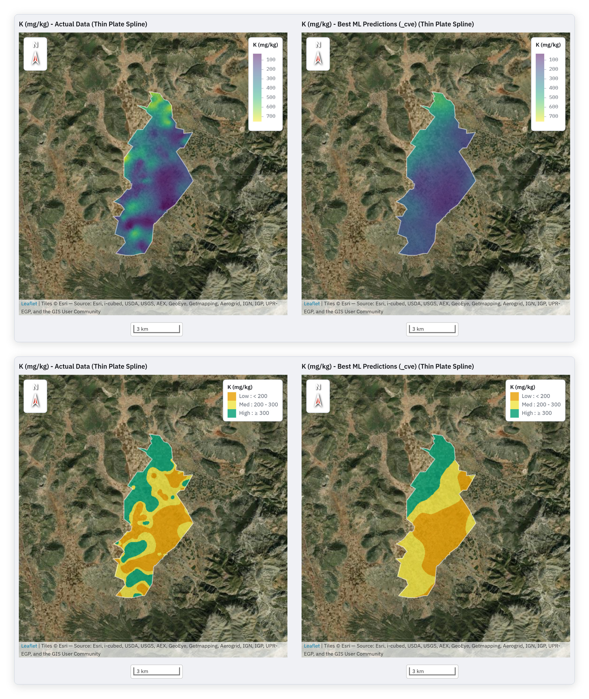

*Figure 9. Measured against machine-learning-predicted potassium (Thin Plate Spline), continuous on one colour range (top) and binned at the same supervised class limits (bottom). The class version is directly comparable when both surfaces are cut at the same limits: supervised limits always are, and **Match Scales** gives Jenks, K-Means and Binned classes one set of breaks computed from both surfaces; for the continuous version, **Match Scales** forces one colour range across the pair.*


**2. Residual Diagnostics**

To understand the spatial structure of model errors, Monolith provides two diagnostic maps:

*Interpolated Delta (regional bias):* subtracts the predicted surface from the actual surface, so zones of consistent over- or under-prediction stand out. This is the left panel of the Map Viewer's residual view.

*Point residuals (local model failure):* the prediction error at each sampling point, drawn as discrete markers on a zero-centred diverging scale and additionally interpolated into an error surface for export, mapping where the model fails to capture local variation.

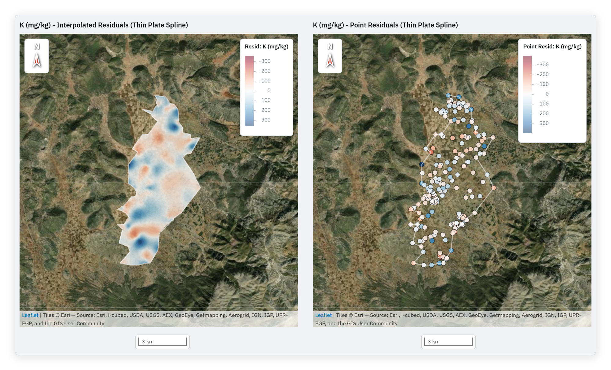

*Figure 10. The two residual diagnostics for the same pair of measured and predicted potassium surfaces. Left: the interpolated delta between the measured and predicted surfaces. Right: the residual at each sample point on a zero-centred diverging scale, where blue and red mark under- and over-prediction and clusters of same-signed points indicate spatially structured error.*


## Installation and Setup Guide

### 1. System Prerequisites

Before installing the application, ensure you have the following software installed:

*   **R:** Version **4.5.0 or higher** is required and is checked at startup; Monolith is developed and tested on **R 4.5.2**. You can download it from [CRAN](https://cran.r-project.org/).
*   **RStudio (Optional, use your default browser with R for the best performance):** The easiest way to run and interact with Shiny applications. Download from [Posit](https://posit.co/download/rstudio-desktop/).
*   **System Dependencies for Spatial Packages:** The spatial stack (`sf`, `terra`) links against GDAL, GEOS and PROJ. Monolith is tested against **GDAL 3.12.1, GEOS 3.14.1 and PROJ 9.7.1**; any reasonably recent releases of these libraries will work.
    *   **Windows:** Nothing to do for the normal install; CRAN ships the spatial packages as self-contained binaries. [RTools](https://cran.r-project.org/bin/windows/Rtools/) (matching your R version) is needed only if you install through `renv::restore()`, which builds any pinned version CRAN has since superseded from source (see [Package Dependencies](#3-package-dependencies)).
    *   **macOS:** You may need to install `gdal` and `proj` via Homebrew (`brew install gdal proj`).
    *   **Linux (Ubuntu/Debian):** Install spatial libraries using your package manager:
        ```bash
        sudo apt-get update
        sudo apt-get install libgdal-dev libproj-dev libgeos-dev libudunits2-dev
        ```

### 2. Getting the Code

Two equally valid ways to obtain Monolith:

*   **Download as ZIP (no Git required):** Click the green **`<> Code`** button at the top of this repository page, choose **Download ZIP**, and extract it anywhere on your machine.
*   **Clone with Git:**
    ```bash
    git clone https://github.com/rserdarkara-hash/monolith.git
    ```

### 3. Package Dependencies

Monolith depends on **64 packages** for its spatial engine, statistical analytics, and user interface, all pinned in `renv.lock` (see [Reproducible installation](#reproducible-installation-with-renv-optional)): 63 from CRAN, and [leaflet.extras](https://github.com/leaflet-extras) from its GitHub repository at a pinned commit.

> **Deciding to install the dependencies:** `global.R` checks the suite at startup, names anything missing, and offers two routes rather than installing on its own:

> **To use the app, take the first:** `install.packages()` with the current CRAN releases, which arrive as pre-built binaries in a few minutes and need no compiler.

> **To reproduce the recorded test values of [Testing and Reproducibility](#testing-and-reproducibility), take the second:** `renv::restore()`, which installs the exact versions in `renv.lock`. Any of those that CRAN has since superseded build from source, which takes longer and needs a C/C++/Fortran toolchain (RTools on Windows). The pinned versions matter for reproducing the test baselines (or the baselines that you will create with your own data; see the section below `Freezing your own dataset as the reference`), not for analysing the data. Nothing is installed without your explicit confirmation.

The full dependency suite, grouped by function:

| Category | Packages |
|---|---|
| **Core App / UI** | `shiny`, `shinyjs`, `shinyWidgets`, `shinyFiles`, `shinycssloaders`, `DT` |
| **Spatial / GIS** | `sf`, `terra`, `tidyterra`, `leaflet`, `leaflet.extras`, `ggspatial`, `fields`, `classInt`, `Ckmeans.1d.dp`, `gstat`, `concaveman`, `spdep`, `FNN` |
| **Data Wrangling & I/O** | `dplyr`, `tidyr`, `data.table`, `jsonlite`, `readxl`, `openxlsx`, `officer`, `zip`, `fs` |
| **Visualization & Theming** | `ggplot2`, `plotly`, `RColorBrewer`, `viridis`, `patchwork`, `showtext`, `scales`, `commonmark` |
| **Statistics & Machine Learning** | `randomForest`, `DALEX`, `yardstick`, `agricolae`, `mgcv`, `nortest` |
| **Classification (tidymodels)** | `parsnip`, `recipes`, `workflows`, `tune`, `rsample`, `dials`, `spatialsample`, `hardhat`, `ranger`, `xgboost`, `nnet` |
| **Parallelization / Async** | `future`, `furrr`, `promises` |
| **CRS catalogue** | `DBI`, `RSQLite` |
| **Called directly, not attached** | `parallelly`, `units`, `rlang`, `htmltools`, `tibble`, `viridisLite` |

<details>
<summary><strong>Tested version matrix</strong>: the exact package versions Monolith 1.1.4 is developed and validated against (click to expand)</summary>

<br>

Newer CRAN releases are expected to work; if you encounter an inconsistency, matching these versions is the first troubleshooting step.

| Package | Version | Package | Version | Package | Version |
|---|---|---|---|---|---|
| `shiny` | 1.14.0 | `dplyr` | 1.2.1 | `randomForest` | 4.7-1.2 |
| `shinyjs` | 2.1.1 | `tidyr` | 1.3.2 | `DALEX` | 2.5.4 |
| `shinyWidgets` | 0.9.1 | `data.table` | 1.18.6.1 | `yardstick` | 1.4.0 |
| `shinyFiles` | 0.9.3 | `jsonlite` | 2.0.0 | `agricolae` | 1.3-7 |
| `shinycssloaders` | 1.1.0 | `readxl` | 1.5.0 | `mgcv` | 1.9-4 |
| `DT` | 0.34.0 | `openxlsx` | 4.2.9 | `nortest` | 1.0-4 |
| `sf` | 1.1-3 | `officer` | 0.7.6 | `future` | 1.75.0 |
| `terra` | 1.9-50 | `zip` | 3.0.2 | `furrr` | 0.4.0 |
| `tidyterra` | 1.3.0 | `fs` | 2.1.0 | `promises` | 1.5.0 |
| `leaflet` | 2.2.3 | `ggplot2` | 4.0.3 | `patchwork` | 1.3.2 |
| `leaflet.extras` | 2.0.1.9000 | `Ckmeans.1d.dp` | 4.3.6 | `showtext` | 0.9-8 |
| `ggspatial` | 1.1.10 | `plotly` | 4.12.1 | `scales` | 1.4.0 |
| `fields` | 17.3 | `RColorBrewer` | 1.1-3 | `commonmark` | 2.0.0 |
| `classInt` | 0.4-11 | `viridis` | 0.6.5 | `DBI` | 1.3.0 |
| `gstat` | 2.1-6 | `concaveman` | 1.2.0 | `spdep` | 1.4-2 |
| `FNN` | 1.1.4.1 | `parsnip` | 1.6.0 | `recipes` | 1.4.0 |
| `workflows` | 1.3.0 | `tune` | 2.1.0 | `rsample` | 1.3.2 |
| `dials` | 1.4.4 | `spatialsample` | 0.6.1 | `hardhat` | 1.4.3 |
| `ranger` | 0.18.0 | `xgboost` | 3.2.1.1 | `nnet` | 7.3-21 |
| `RSQLite` | 3.53.3 | `parallelly` | 1.48.0 | `units` | 1.0-1 |
| `rlang` | 1.3.0 | `htmltools` | 0.5.9 | `tibble` | 3.3.1 |
| `viridisLite` | 0.4.3 |  |  |  |  |

**Runtime environment:** R 4.5.2 (ucrt) · GDAL 3.12.1 · GEOS 3.14.1 · PROJ 9.7.1 · Windows 11 (also runs on macOS and Linux).

</details>

#### Reproducible installation with `renv` (optional)

For an exact, one-command reproduction of the validated environment, the repository ships a [`renv`](https://rstudio.github.io/renv/) lockfile (`renv.lock`) pinning the dependency tree (including transitive dependencies) to the versions in the matrix above. All 64 packages listed in `global.R` are covered, the Classification Suite's tidymodels stack included. From the project root:

```r
install.packages("renv")   # once
renv::restore()             # reads renv.lock; confirm the prompt to activate the project
```

This installs the pinned versions into a project-local library without touching your global R library. `leaflet.extras` is fetched from GitHub, so this step needs access to github.com. Any locked version that CRAN has since superseded is built from source, which needs a toolchain (RTools on Windows, Xcode command line tools on macOS, the `-dev` headers listed in Section 1 on Linux). Reach for it when you want to reproduce the recorded test values; for ordinary analysis the current CRAN releases are the faster and equally valid choice.

### 4. Input Data Requirements

Monolith reads a single flat table of point observations, one row per sample:

*   **File format:** `.xlsx`, `.xls`, or `.csv`. The first row holds column headings.
*   **Coordinates:** one column of X (easting or longitude) and one of Y (northing or latitude), in a single coordinate reference system. Coordinates within ±180/±90 are read as EPSG:4326 when the column names say longitude and latitude, or when an uploaded boundary confirms that reading; otherwise the app asks, because a local grid in metres fits the same ranges. Projected coordinates cannot reveal their zone, so the app asks you to select or type the CRS (EPSG code, PROJ string, or WKT).
*   **Variables:** at least one numeric column to interpolate. Any further numeric columns are available as covariates for RK, RFK, and CK, and as inputs to the correlation, PCA, governing-factors, and classification modules. Covariates must be co-sampled, that is, measured at the same points as the target.
*   **Localities (optional):** a text column grouping samples into fields, sites, or farms. Each locality is modelled separately. Without one, the dataset is treated as a single region; groups can also be drawn on the map afterwards.
*   **Categorical columns (optional):** text or factor columns are the targets available to the Classification Suite and the grouping factors used by the descriptive suite.
*   **Variable list (optional):** a second file (`.xlsx`, `.xls`, `.csv`) mapping column names to display labels, units, and categories, which is what drives the readable axis titles and the variable folders in the sidebar. See `sample_data/samp_var_list.xlsx`.
*   **Boundary shapefile (optional):** upload `.shp` together with `.shx`, `.dbf`, and `.prj` to clip surfaces to a known field boundary.

The Data Setup tab validates the mapping before anything is modelled: a mini-map colours the points by locality so a swapped X/Y pair or a wrong CRS is visible immediately. See the [User Guide](docs/user_guide.md) for the full ingestion walkthrough.

### 5. Application Structure

Ensure your project directory has the following structure. 

The application consists of a centralized package loader, a main runner file, and several helper scripts:

```
monolith/
│
├── global.R                          # Centralized package loader & environment configuration
├── monolith.R                        # Main Application Runner (assembles UI + server from the files below)
├── global_utils.R                    # Static configuration & pure utility functions
│
├── ui_main.R                         # Master UI assembly (fluidPage skeleton)
├── ui_sidebar.R                      # Sidebar panel definition
├── ui_main_tabs.R                    # Main tab panel definition
│
├── server_setup.R                    # Session infrastructure, caches & central reactive state
├── server_export.R                   # Export registry, styler & batch export handlers
├── server_map_interactions.R         # Draw tools, popups & point styling
├── server_data_setup.R               # Upload, CRS parsing & variable mapping
├── server_run_config.R               # Display context, config persistence & selectors
├── server_model_tuning.R             # Per-locality IDW/TPS values & variogram tuning
├── server_execution.R                # Parallel interpolation pipeline (future/furrr)
├── server_map_viewer.R               # Leaflet map rendering & proxy overlays
├── server_sci_analysis.R             # Diagnostics, metrics & results tables
│
├── spatial_helpers.R                 # Geostatistical core loader (sources the four spatial_* files)
├── spatial_vgm.R                     # Variogram fitting machinery
├── spatial_metrics.R                 # CV folds, error metrics & Moran's I
├── spatial_kriging.R                 # Interpolation engines (IDW/TPS/OK/CK/RK/RFK)
├── spatial_pipeline.R                # Regional orchestration & parallel worker entry points
│
├── ui_helpers.R                      # UI/analytics helper loader (sources the four ui_* helper files)
├── ui_colors.R                       # Palettes & colour resolution
├── ui_formatting.R                   # Labels, metadata matching & fuzzy matching helpers
├── ui_components.R                   # Shiny widget/tag generators
├── ui_plotting.R                     # Descriptive, correlation, PCA & diagnostic plot builders
│
├── theme_helpers.R                   # Theming & export configurations
├── gov_module.R                      # Governing Factors UI & Server Modules
├── desc_exploratory_module.R         # Descriptive & Exploratory Suite (Tab 5 Module)
├── classif_helpers.R                 # Supervised classification engine (tidymodels)
├── classif_module.R                  # Classification Suite UI & Server Module (Tab 6)
│
├── assets/                           # Screenshots & static assets
├── docs/                             # User, scientific & module guides
├── sample_data/                      # Demo datasets (restricted license)
├── tests/                            # testthat unit & regression test suite
│   └── testthat/fixtures/            # Frozen golden dataset, baselines & generators
├── .github/workflows/                # CI: tests.yaml (pinned, Linux + Windows), upstream.yaml (weekly, latest CRAN)
│
├── DESCRIPTION                       # Package metadata; the version the app reads at startup
├── renv.lock                         # Pinned dependency tree for renv::restore()
├── CITATION.cff                      # Machine-readable citation metadata
├── README.md                         # This document
├── CHANGELOG.md                      # Version history of notable changes
├── CONTRIBUTING.md                   # Contribution rules: architecture, testing, baselines
└── LICENSE                           # GPL-3.0 license
```

### 6. Running the Application

#### Option A: Using RStudio (Recommended)
1. Open the `monolith.R` file in RStudio.
2. Ensure all required packages are installed and loaded without errors.
3. Click the **"Run App"** button (with "Run External" ticked for the best performance) located at the top right of the source editor.

#### Option B: Using the R Console
1. Open your R console or terminal.
2. Set your working directory to the folder containing the app:
   ```R
   setwd("/path/to/your/monolith/directory")
   ```
3. Launch the Shiny app:
   ```R
   shiny::runApp("monolith.R", launch.browser = TRUE)
   ```

If a package is missing, startup names it and asks before installing anything; take the current CRAN releases unless you specifically need the pinned ones (see [Package Dependencies](#3-package-dependencies)). With the library complete, startup takes seconds.

## Documentation

Detailed guides live in the [docs/](docs/) directory. Each carries its own reference list, and every work cited is given with a DOI, ISBN or proceedings reference:

| Guide | Contents |
|---|---|
| [User Guide](docs/user_guide.md) | End-to-end walkthrough: data ingestion, interpolation workflow, export registry |
| [Scientific Guide](docs/scientific_guide.md) | Mathematical formulation of the interpolation engines, variogram fitting, cross-validation metrics and the supervised classification methodology |
| [Descriptive & Exploratory Guide](docs/desc_exploratory_guide.md) | Descriptive statistics, correlation, PCA and the Governing Factors module |

Sample datasets in [sample_data/](sample_data/) let you exercise every module without your own data (see [License](#license) for their usage restrictions).

## Testing and Reproducibility

Monolith ships with a `testthat` suite of 5,878 assertions across 36 test files, covering the interpolation pipeline, cross-validation metrics, variogram fitting, the classification engine, the descriptive/correlation/PCA plot builders, metadata matching and the Governing Factors module. Where a quantity has an external or closed-form reference, the tests assert against that rather than against the app's own output: IDW against the hand-written Shepard sum, Ordinary Kriging against its exactness and pure-nugget closed forms, RK and RFK against the trend-plus-kriged-residual decomposition, VIF against `1/(1 - R²)` from an actual regression, Moran's I against a hand-built weight matrix, the classification and agreement metrics against a hand-built confusion matrix, the agronomical class bins against `terra::classify`'s own output, the PCA spectrum against the eigenvalues of the correlation and covariance matrices, Lin's CCC against a value computed independently with `DescTools`, and the plotted variogram curves against `gstat::variogramLine`. Those tests run on a frozen extract of the sample survey (`tests/testthat/fixtures/`), so their inputs never move and a changed number means the code changed; that directory's `GOLDEN_MANIFEST.md` states what a green suite does and does not establish, and the required properties and metadata for a replacement golden dataset. A separate file boots the assembled application in a headless browser through `shinytest2` and checks the shell (server initialisation, input identifiers, tab wiring, documentation drawer); it skips itself when `shinytest2` or a Chromium-based browser is unavailable. The suite runs on every push through GitHub Actions against the pinned `renv.lock` environment, on Linux and on Windows - the platform is not incidental, since one recorded value was once resolved differently by the two platforms' floating-point paths. A second, weekly workflow (`upstream.yaml`) runs the same suite against the current CRAN releases instead of the pinned ones, so a change in an upstream package that moves one of the recorded values is reported as upstream news rather than being discovered months later; it never gates a pull request. To run everything from the project root:

```bash
Rscript tests/testthat.R
```

The first run is slow because the harness sources the full application (all 64 packages); this is expected. Scientific accuracy is treated as the project's primary invariant; changes that alter numeric results are gated on these tests.

### Freezing your own dataset as the reference

Custom golden fixtures are a developer extension. They must supply the full canonical column schema and satisfy the structural requirements in [GOLDEN_MANIFEST.md](tests/testthat/fixtures/GOLDEN_MANIFEST.md). Tests select localities by population size or spatial extent, and the localities on which they draw hull or buffered boundaries must be sampled densely and evenly enough for them. Method-specific cases can be supplied through fixture metadata (`test_cases`); the tests verify their required TPS, kNNDM and variogram behavior rather than assuming it from a place name. The recorded baselines guard the quantities the suite exercises, not every result of an external analysis.

```r
source("tests/testthat/fixtures/make_golden.R")
make_golden(src_data = "my_survey.xlsx",
            src_meta = NULL,
            out_dir  = "tests/testthat/fixtures_mine",
            roles    = list(locality = "site", x = "easting", y = "northing",
                            crs = 25832,
                            soil = c("pH_lab", "ec", "caco3", "som", "sand",
                                     "silt", "clay", "tn", "p", "k", "ca",
                                     "mg", "na", "fe", "cu", "zn", "mn")))

# Point the suite at your fixture, then record its baselines. Do both from the
# project root, and set the variable rather than the option if you prefer to run
# the recorder as a separate `Rscript` process, which would not inherit it.
Sys.setenv(MONOLITH_GOLDEN_DIR = "tests/testthat/fixtures_mine")
source("tests/testthat/fixtures/make_baselines.R")
```

The recorder runs the whole suite first and refuses to record anything from a failing tree. It records the few quantities that have no closed form (Jenks breaks, the iterative VIF drop order, the end-to-end surface digest) together with the R and package versions they were measured under. Commit `tests/testthat/fixtures_mine/` with your analysis and archive the repository; a reader can re-run the suite and get the same values.

The example maps `pH_lab` to the canonical `ph` column and assumes every other required column, except the named locality and coordinates, already uses its canonical name. Set the ordered `roles$soil`, `roles$pred` and `roles$covariates` vectors to map all 17 soil properties, 6 prediction columns and 10 covariates; a role name the generator does not define, such as a scalar `target`, is rejected. Name in `test_cases` any method-specific case your survey carries under other localities or variables, keep independently defined numerical expectations, and never bypass the recorder's test gate.

## Scope and Limitations

Stating what the application does not do is part of using it correctly:

*   **Two-dimensional, point-referenced data only.** There is no depth or 3D interpolation and no space-time modelling; a time series is handled by mapping each date separately.
*   **All interpolation engines are omnidirectional.** Anisotropy can be diagnosed (see the directional variogram panel) but not modelled: no anisotropic variogram, no directional search neighbourhood.
*   **One nugget plus one structure per variogram**, fitted by weighted least squares with Matern smoothness fixed at ν = 1.5. Nested structures, REML or maximum-likelihood fitting, and free smoothness estimation are out of scope.
*   **Covariates are table columns, not rasters.** RK, RFK, and CK take covariates co-sampled at the observation points and krige them onto the prediction grid; external raster stacks (DEM derivatives, satellite bands) are not read directly and must be sampled to the points beforehand. The resulting covariate surfaces are themselves interpolations, and their error propagates into the prediction (Scientific Guide §10.4).
*   **Uncertainty is model-based.** The mapped variance is the kriging variance under the fitted model, not a posterior from a Bayesian formulation and not a conditional-simulation ensemble; it inherits every assumption the variogram makes and does not account for uncertainty in the variogram fit itself. It is the prediction variance of a new measurement, so it includes the nugget and stays above it between samples.
*   **Classification is limited to three learners** (multinomial, Random Forest, XGBoost) on tabular covariates, with no synthetic oversampling by design (see [Guardrails](#scientific-guardrails)).
*   **Single-user desktop application.** It is designed for one analyst on one machine: a pool of six background workers (fewer on a machine with fewer cores) holds the concurrent tasks, and the computation runs in nested clusters of local cores beneath them. It is not hardened for multi-user server deployment, and the run-duration history is not synchronised across concurrent sessions.
*   **Not a GIS.** There is no digitizing, topology editing, raster algebra, or general layer management beyond what the analysis itself needs.

## Development and AI Assistance

Monolith was built with AI-assisted development tools and is disclosed here in the interest of scientific transparency: the codebase was initially structured as a Shiny App with **Antigravity CLI** (Google DeepMind), then systematically audited, refined and upgraded with **Claude Code (models Fable and Opus; Anthropic)** and **Codex (model GPT Astra; OpenAI)**, covering debugging, performance optimization, maintenance of function flows, and user interface/experience modifications.

Human oversight remained central throughout: all methodological choices, model formulations, interpolation engines, variogram fitting, cross-validation metrics, mathematical implementations, and scientific decisions were specified, reviewed, and validated by the author. Numeric behavior is guarded by the `testthat` suite described [above](#testing-and-reproducibility), and any change that alters numeric results is treated as a scientific decision requiring explicit justification. Responsibility for the correctness of the software rests with the author, not the tools. This disclosure mirrors the statement in the associated publication.

## Author

**R. Serdar Kara** ([ORCID: 0000-0003-1297-2328](https://orcid.org/0000-0003-1297-2328)).

## How to Cite

```bibtex
@software{monolith2026,
  title     = {Monolith: A Spatial Analysis Dashboard for Geostatistical Modeling and Mapping},
  author    = {Kara, R. Serdar},
  year      = {2026},
  version   = {1.1.4},
  doi       = {10.5281/zenodo.21130951},
  publisher = {Zenodo},
  url       = {https://github.com/rserdarkara-hash/monolith},
  note      = {R Shiny application, GPL-3.0}
}
```

The same reference is available from GitHub's **Cite this repository** button, which reads the [CITATION.cff](CITATION.cff) file in the repository root. The DOI above is the **concept DOI** and always resolves to the latest release; Zenodo also mints a version-specific DOI for each release, which is the one to cite when the exact version matters for reproducing a result.

## Contributing and Support

*   **Bug reports & feature requests:** Please open an [Issue](../../issues) on this repository. Include your R version, operating system, and a minimal description of the steps that reproduce the problem.
*   **Questions:** The [Discussions](../../discussions) tab (if enabled) or an Issue are both fine.
*   **Pull requests:** Contributions are welcome under the GPL-3.0 terms. Read [CONTRIBUTING.md](CONTRIBUTING.md) first: it sets out the architecture rules, how tests must be written, and what a pull request that moves a recorded number has to state.

## License

This project uses a dual-licensing structure: one license for the software and a separate one for the bundled sample data:

*   **Software & Source Code**: The core codebase of **Monolith** is licensed under the **GNU General Public License v3.0 (GPL-3.0)**. You are free to run, study, share, and modify the software, provided all derivative works remain open-source under the same terms. See the [LICENSE](LICENSE) file for the full legal text.

*   **Sample Data**: `samp_data_1.xlsx` and its variable list `samp_var_list.xlsx` in [sample_data/](sample_data/) are **not** covered by the GPL-3.0. They accompany a manuscript submitted for peer review and are provided strictly for demonstration, evaluation, and testing of the Monolith application. They are **not** licensed for third-party use until that manuscript is formally published, at which point they will be released under [Creative Commons Attribution 4.0 International (CC BY 4.0)](https://creativecommons.org/licenses/by/4.0/). Until then, all rights are reserved and the restrictions apply to all third parties. The full terms are in [sample_data/DATA_LICENSE](sample_data/DATA_LICENSE).

## Disclaimer

Monolith is provided **"as is"**, without warranty of any kind, express or implied, including, but not limited to, warranties of merchantability, fitness for a particular purpose, and non-infringement, as set out in Sections 15 and 16 of the [GPL-3.0 license](LICENSE). In no event shall the author be liable for any claim, damages, or other liability arising from the use of this software.

In particular, for scientific and applied use: the quality of any interpolation, classification, or statistical output depends on the input data, sampling design, and model assumptions you choose. **You are responsible for validating the results for your own application**, including any agronomic, environmental, or management decision informed by them. The diagnostic tools built into Monolith (cross-validation metrics, residual maps, variogram inspection) exist precisely to support that validation; please use them.
